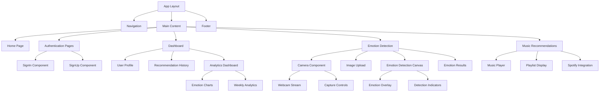

# Moodify Frontend Design

## Overview

This document outlines the frontend architecture for **Moodify**, a music recommendation web application built with Next.js that uses facial emotion recognition to suggest music based on the user's current emotional state.

### Core Features
- Facial emotion detection through camera capture or image upload
- Music recommendations based on detected emotions
- User authentication and account management
- Recommendation history storage and access
- Dashboard with emotion analytics (bonus feature)
- Integration with Spotify API for music recommendations
- Responsive design for various devices

## Technology Stack & Dependencies

### Core Framework
- **Next.js 14+**: React framework with App Router for SSR/SSG capabilities
- **React 18+**: UI library with hooks and modern patterns
- **TypeScript**: Type safety and enhanced developer experience

### Emotion Recognition
- **face-api.js**: Machine learning library for facial emotion detection
- **react-webcam**: React component for camera access and video streaming
- **AWS Rekognition**: Cloud-based emotion analysis (alternative/enhancement)

### Music Integration
- **Spotify Web API**: Music streaming and recommendation service
- **Spotify Web Playback SDK**: In-browser music playback

### Authentication
- **Auth.js (NextAuth.js)**: Authentication solution with multiple providers
- **@auth/prisma-adapter**: Database adapter for user sessions

### UI & Styling
- **Tailwind CSS**: Utility-first CSS framework
- **Headless UI**: Unstyled, accessible UI components
- **React Hook Form**: Form handling with validation
- **Zod**: Schema validation

### Additional Dependencies
- **Canvas API**: Image processing and emotion data extraction
- **File API**: Image upload and processing
- **Chart.js/Recharts**: Dashboard analytics visualization
- **IndexedDB/localStorage**: Client-side caching for recommendations
- **Axios**: HTTP client for API communications

## Component Architecture

### Component Hierarchy



### Core Components

#### 1. Camera Component (`/components/Camera/EmotionCapture.tsx`)

```typescript
interface EmotionCaptureProps {
  onEmotionDetected: (emotion: EmotionData) => void;
  onImageCapture: (imageData: string) => void;
  isActive: boolean;
  mode: 'camera' | 'upload';
}
```

**Features:**
- Real-time webcam streaming
- Emotion detection overlay
- Image capture functionality
- Image upload support

#### 2. Emotion Detection Canvas (`/components/Emotion/DetectionCanvas.tsx`)

```typescript
interface EmotionCanvasProps {
  videoRef: React.RefObject<HTMLVideoElement>;
  emotions: EmotionDetection[];
  showConfidence: boolean;
}
```

**Features:**
- Overlay emotion indicators
- Display confidence scores
- Real-time emotion tracking
- Visual feedback for detected emotions

#### 3. Authentication Components

```typescript
// SignIn Component
interface SignInProps {
  providers: Provider[];
  callbackUrl?: string;
}

// Protected Route Wrapper
interface ProtectedRouteProps {
  children: React.ReactNode;
  requiredRole?: 'user' | 'admin';
}
```

#### 4. Music Recommendation Component (`/components/Music/RecommendationDisplay.tsx`)

```typescript
interface MusicRecommendationProps {
  emotion: DetectedEmotion;
  recommendations: SpotifyTrack[];
  onTrackSelect: (track: SpotifyTrack) => void;
  isLoading: boolean;
}
```

**Features:**
- Display emotion-based playlists
- Track preview and selection
- Spotify integration
- Save recommendations to history

#### 5. Dashboard Analytics (`/components/Dashboard/EmotionAnalytics.tsx`)

```typescript
interface AnalyticsDashboardProps {
  user: User;
  emotionHistory: EmotionAnalysis[];
  weeklyData: WeeklyEmotionData;
}
```

**Features:**
- Weekly emotion charts
- Analysis frequency tracking
- Positive vs negative emotion ratios
- Interactive data visualization

## Routing & Navigation

### App Router Structure

```
app/
├── layout.tsx                 # Root layout with providers
├── page.tsx                   # Home page with emotion capture
├── globals.css               # Global styles
│
├── auth/
│   ├── signin/
│   │   └── page.tsx          # Sign in page
│   └── signup/
│       └── page.tsx          # Sign up page
│
├── dashboard/
│   ├── layout.tsx            # Dashboard layout
│   ├── page.tsx              # Main dashboard
│   ├── profile/
│   │   └── page.tsx          # User profile
│   ├── history/
│   │   └── page.tsx          # Recommendation history
│   └── analytics/
│       └── page.tsx          # Emotion analytics (bonus)
│
├── emotion/
│   ├── detect/
│   │   └── page.tsx          # Emotion detection page
│   └── upload/
│       └── page.tsx          # Image upload for analysis
│
├── music/
│   ├── recommendations/
│   │   └── page.tsx          # Music recommendations display
│   └── player/
│       └── page.tsx          # Music player interface
│
└── api/
    ├── auth/
    │   └── [...nextauth]/
    │       └── route.ts      # Auth.js configuration
    ├── emotion/
    │   ├── detect/
    │   │   └── route.ts      # Emotion detection API
    │   └── analyze/
    │       └── route.ts      # Image analysis API
    ├── music/
    │   ├── recommendations/
    │   │   └── route.ts      # Music recommendation API
    │   └── spotify/
    │       └── route.ts      # Spotify integration
    └── users/
        ├── route.ts          # User management
        └── history/
            └── route.ts      # Recommendation history
```

### Navigation Component

```typescript
interface NavigationItem {
  label: string;
  href: string;
  icon: React.ComponentType;
  requiresAuth: boolean;
}

const navigationItems: NavigationItem[] = [
  { label: 'Home', href: '/', icon: HomeIcon, requiresAuth: false },
  { label: 'Detect Emotion', href: '/emotion/detect', icon: CameraIcon, requiresAuth: true },
  { label: 'Dashboard', href: '/dashboard', icon: DashboardIcon, requiresAuth: true },
  { label: 'Music', href: '/music/recommendations', icon: MusicIcon, requiresAuth: true },
  { label: 'Analytics', href: '/dashboard/analytics', icon: ChartIcon, requiresAuth: true },
];
```

## Styling Strategy

### Tailwind CSS Configuration

```typescript
// tailwind.config.js
module.exports = {
  content: ['./app/**/*.{js,ts,jsx,tsx}', './components/**/*.{js,ts,jsx,tsx}'],
  theme: {
    extend: {
      colors: {
        primary: {
          50: '#eff6ff',
          500: '#3b82f6',
          900: '#1e3a8a',
        },
        emotion: {
          happy: '#fbbf24',
          sad: '#3b82f6',
          angry: '#ef4444',
          surprised: '#f59e0b',
          neutral: '#6b7280',
          fear: '#8b5cf6',
          disgust: '#059669',
        },
        music: {
          primary: '#1db954', // Spotify green
          secondary: '#191414', // Spotify black
          accent: '#1ed760',
        }
      },
      animation: {
        'pulse-slow': 'pulse 3s cubic-bezier(0.4, 0, 0.6, 1) infinite',
        'emotion-glow': 'emotion-glow 2s ease-in-out infinite',
        'music-wave': 'music-wave 1.5s ease-in-out infinite',
      }
    },
  },
  plugins: [require('@tailwindcss/forms')],
}
```

### Component Styling Patterns

```typescript
// Styling utilities for emotion detection and music UI
const emotionStyles = {
  overlay: "absolute inset-0 pointer-events-none",
  emotionIndicator: "absolute bg-gradient-to-r from-emotion-happy to-emotion-sad text-white px-3 py-2 text-sm rounded-full",
  confidence: "absolute bg-black bg-opacity-75 text-white px-2 py-1 text-xs rounded",
  emotionGlow: "absolute inset-0 rounded-lg animate-emotion-glow",
};

const cameraStyles = {
  container: "relative w-full max-w-2xl mx-auto",
  video: "w-full h-auto rounded-lg shadow-lg",
  controls: "absolute bottom-4 left-1/2 transform -translate-x-1/2",
  captureButton: "bg-music-primary hover:bg-music-accent text-white rounded-full p-4 transition-colors",
  uploadArea: "border-2 border-dashed border-gray-300 rounded-lg p-8 text-center hover:border-music-primary transition-colors",
};

const musicPlayerStyles = {
  container: "bg-music-secondary text-white rounded-lg p-6",
  trackCard: "bg-gray-800 rounded-lg p-4 hover:bg-gray-700 transition-colors cursor-pointer",
  playButton: "bg-music-primary hover:bg-music-accent rounded-full p-3 transition-colors",
  progressBar: "w-full bg-gray-600 rounded-full h-2",
  waveform: "flex items-end space-x-1 animate-music-wave",
};
```

## State Management

### Context Providers

#### 1. Emotion Detection Context

```typescript
interface EmotionDetectionContextType {
  // Models and initialization
  modelsLoaded: boolean;
  loadingProgress: number;
  initializeEmotionAPI: () => Promise<void>;
  
  // Emotion detection
  isDetecting: boolean;
  detectedEmotions: EmotionDetection[];
  currentEmotion: DetectedEmotion | null;
  startDetection: () => void;
  stopDetection: () => void;
  
  // Image analysis
  analyzeImage: (imageData: string) => Promise<EmotionAnalysisResult>;
  
  // Settings
  detectionSettings: EmotionDetectionSettings;
  updateSettings: (settings: Partial<EmotionDetectionSettings>) => void;
}
```

#### 2. Music Recommendation Context

```typescript
interface MusicContextType {
  // Spotify integration
  isSpotifyConnected: boolean;
  connectSpotify: () => Promise<void>;
  spotifyToken: string | null;
  
  // Recommendations
  currentRecommendations: SpotifyTrack[];
  isLoadingRecommendations: boolean;
  getRecommendations: (emotion: DetectedEmotion) => Promise<SpotifyTrack[]>;
  
  // Playback
  currentTrack: SpotifyTrack | null;
  isPlaying: boolean;
  playTrack: (track: SpotifyTrack) => void;
  pauseTrack: () => void;
  
  // History
  recommendationHistory: RecommendationHistory[];
  saveToHistory: (emotion: DetectedEmotion, tracks: SpotifyTrack[]) => void;
}
```

#### 3. Analytics Context

```typescript
interface AnalyticsContextType {
  // Weekly data
  weeklyEmotions: WeeklyEmotionData;
  dailyAnalyses: DailyAnalysisCount[];
  emotionRatio: EmotionRatio;
  
  // Data fetching
  isLoadingAnalytics: boolean;
  fetchWeeklyData: () => Promise<void>;
  
  // Real-time tracking
  trackEmotionAnalysis: (emotion: DetectedEmotion) => void;
  getEmotionTrends: () => EmotionTrend[];
}
```

#### 2. Camera Context

```typescript
interface CameraContextType {
  // Camera state
  isActive: boolean;
  stream: MediaStream | null;
  videoRef: React.RefObject<HTMLVideoElement>;
  
  // Camera controls
  startCamera: () => Promise<void>;
  stopCamera: () => void;
  captureImage: () => string | null;
  
  // Camera settings
  deviceId: string;
  availableDevices: MediaDeviceInfo[];
  switchDevice: (deviceId: string) => void;
  
  // Permissions
  hasPermission: boolean;
  requestPermission: () => Promise<boolean>;
}
```

### Custom Hooks

#### useEmotionDetection Hook

```typescript
interface UseEmotionDetectionOptions {
  interval?: number;
  minConfidence?: number;
  enableRealTime?: boolean;
}

interface UseEmotionDetectionReturn {
  emotions: EmotionDetection[];
  currentEmotion: DetectedEmotion | null;
  isDetecting: boolean;
  confidence: number;
  startDetection: (video: HTMLVideoElement) => void;
  stopDetection: () => void;
  analyzeImage: (imageData: string) => Promise<EmotionAnalysisResult>;
  error: string | null;
}

const useEmotionDetection = (options: UseEmotionDetectionOptions): UseEmotionDetectionReturn;
```

#### useMusicRecommendations Hook

```typescript
interface UseMusicRecommendationsReturn {
  recommendations: SpotifyTrack[];
  isLoading: boolean;
  currentPlaylist: SpotifyPlaylist | null;
  getRecommendationsForEmotion: (emotion: DetectedEmotion) => Promise<void>;
  saveRecommendation: (track: SpotifyTrack, emotion: DetectedEmotion) => void;
  history: RecommendationHistory[];
}

const useMusicRecommendations = (): UseMusicRecommendationsReturn;
```

#### useSpotifyPlayer Hook

```typescript
interface UseSpotifyPlayerReturn {
  isConnected: boolean;
  currentTrack: SpotifyTrack | null;
  isPlaying: boolean;
  volume: number;
  connect: () => Promise<void>;
  playTrack: (trackId: string) => Promise<void>;
  pauseTrack: () => void;
  setVolume: (volume: number) => void;
  skipTrack: () => void;
}

const useSpotifyPlayer = (): UseSpotifyPlayerReturn;
```

## API Integration Layer

### API Client Configuration

```typescript
// lib/api-client.ts
class MoodifyAPIClient {
  private baseURL: string;
  
  constructor(baseURL: string) {
    this.baseURL = baseURL;
  }
  
  async analyzeEmotion(data: EmotionAnalysisData): Promise<EmotionAnalysisResponse> {
    const response = await fetch(`${this.baseURL}/api/emotion/analyze`, {
      method: 'POST',
      headers: { 'Content-Type': 'application/json' },
      body: JSON.stringify(data),
    });
    return response.json();
  }
  
  async getMusicRecommendations(emotion: DetectedEmotion): Promise<MusicRecommendationResponse> {
    const response = await fetch(`${this.baseURL}/api/music/recommendations`, {
      method: 'POST',
      headers: { 'Content-Type': 'application/json' },
      body: JSON.stringify({ emotion }),
    });
    return response.json();
  }
  
  async saveRecommendationHistory(data: RecommendationHistoryData): Promise<void> {
    await fetch(`${this.baseURL}/api/users/history`, {
      method: 'POST',
      headers: { 'Content-Type': 'application/json' },
      body: JSON.stringify(data),
    });
  }
  
  async getWeeklyAnalytics(userId: string): Promise<WeeklyAnalyticsResponse> {
    const response = await fetch(`${this.baseURL}/api/users/analytics?userId=${userId}`);
    return response.json();
  }
}
```

### Data Models

```typescript
interface EmotionDetection {
  emotion: EmotionType;
  confidence: number;
  timestamp: Date;
  boundingBox?: BoundingBox;
}

interface DetectedEmotion {
  primary: EmotionType;
  confidence: number;
  secondary?: EmotionType;
  analysis: EmotionAnalysisDetails;
}

interface SpotifyTrack {
  id: string;
  name: string;
  artists: SpotifyArtist[];
  album: SpotifyAlbum;
  preview_url: string;
  external_urls: {
    spotify: string;
  };
  duration_ms: number;
}

interface RecommendationHistory {
  id: string;
  userId: string;
  emotion: DetectedEmotion;
  tracks: SpotifyTrack[];
  timestamp: Date;
  imageData?: string;
}

interface EmotionAnalysisData {
  imageData: string; // Base64 encoded image
  userId: string;
  source: 'camera' | 'upload';
  metadata: AnalysisMetadata;
}

interface WeeklyEmotionData {
  emotions: { [key in EmotionType]: number };
  dailyCounts: DailyAnalysisCount[];
  positiveRatio: number;
  negativeRatio: number;
  totalAnalyses: number;
}

interface DailyAnalysisCount {
  date: string;
  count: number;
  dominantEmotion: EmotionType;
}

type EmotionType = 'happy' | 'sad' | 'angry' | 'surprised' | 'neutral' | 'fear' | 'disgust';
```

## Testing Strategy

### Unit Testing with Jest

```typescript
// Component testing patterns
describe('EmotionCapture Component', () => {
  test('should request camera permission on mount', async () => {
    const mockGetUserMedia = jest.fn().mockResolvedValue(mockStream);
    Object.defineProperty(navigator, 'mediaDevices', {
      value: { getUserMedia: mockGetUserMedia },
    });
    
    render(<EmotionCapture onEmotionDetected={jest.fn()} />);
    
    await waitFor(() => {
      expect(mockGetUserMedia).toHaveBeenCalledWith({
        video: { width: 640, height: 480 },
        audio: false,
      });
    });
  });
  
  test('should detect emotions from captured image', async () => {
    const mockEmotionDetected = jest.fn();
    const mockImageData = 'data:image/jpeg;base64,/9j/4AAQSkZJRgABAQEASA...';
    
    render(<EmotionCapture onEmotionDetected={mockEmotionDetected} />);
    
    const uploadInput = screen.getByLabelText(/upload image/i);
    const file = new File([mockImageData], 'test.jpg', { type: 'image/jpeg' });
    
    await userEvent.upload(uploadInput, file);
    
    await waitFor(() => {
      expect(mockEmotionDetected).toHaveBeenCalledWith(
        expect.objectContaining({
          primary: expect.any(String),
          confidence: expect.any(Number),
        })
      );
    });
  });
});

// Hook testing
describe('useEmotionDetection Hook', () => {
  test('should detect emotions when video is provided', async () => {
    const { result } = renderHook(() => useEmotionDetection());
    const mockVideo = document.createElement('video');
    
    act(() => {
      result.current.startDetection(mockVideo);
    });
    
    await waitFor(() => {
      expect(result.current.isDetecting).toBe(true);
    });
  });
});

describe('useMusicRecommendations Hook', () => {
  test('should fetch recommendations based on emotion', async () => {
    const { result } = renderHook(() => useMusicRecommendations());
    const mockEmotion: DetectedEmotion = {
      primary: 'happy',
      confidence: 0.9,
      analysis: {} as EmotionAnalysisDetails,
    };
    
    await act(async () => {
      await result.current.getRecommendationsForEmotion(mockEmotion);
    });
    
    expect(result.current.recommendations).toHaveLength(10);
    expect(result.current.recommendations[0]).toHaveProperty('name');
  });
});
```

### Integration Testing with Testing Library

```typescript
// Page testing
describe('Emotion Detection Page', () => {
  test('should complete emotion analysis and show music recommendations', async () => {
    const user = userEvent.setup();
    
    render(<EmotionDetectionPage />);
    
    // Start camera
    const startButton = screen.getByRole('button', { name: /start camera/i });
    await user.click(startButton);
    
    // Capture emotion
    const captureButton = screen.getByRole('button', { name: /capture emotion/i });
    await user.click(captureButton);
    
    // Wait for emotion analysis
    await waitFor(() => screen.getByText(/emotion detected/i));
    
    // Verify emotion display
    expect(screen.getByTestId('detected-emotion')).toBeInTheDocument();
    
    // Get music recommendations
    const recommendButton = screen.getByRole('button', { name: /get music recommendations/i });
    await user.click(recommendButton);
    
    // Verify recommendations
    await waitFor(() => screen.getByText(/recommended tracks/i));
    expect(screen.getAllByTestId('track-card')).toHaveLength.greaterThan(0);
  });
});

describe('Analytics Dashboard Page', () => {
  test('should display weekly emotion analytics', async () => {
    const mockAnalytics = {
      emotions: { happy: 40, sad: 20, neutral: 30, angry: 10 },
      dailyCounts: [
        { date: '2024-01-01', count: 5, dominantEmotion: 'happy' },
        { date: '2024-01-02', count: 3, dominantEmotion: 'neutral' },
      ],
      positiveRatio: 0.7,
      negativeRatio: 0.3,
      totalAnalyses: 25,
    };
    
    // Mock API response
    jest.spyOn(global, 'fetch').mockResolvedValue({
      json: () => Promise.resolve(mockAnalytics),
    } as Response);
    
    render(<AnalyticsDashboard />);
    
    // Verify charts are rendered
    await waitFor(() => {
      expect(screen.getByTestId('emotion-pie-chart')).toBeInTheDocument();
      expect(screen.getByTestId('daily-analysis-chart')).toBeInTheDocument();
      expect(screen.getByTestId('emotion-ratio-chart')).toBeInTheDocument();
    });
    
    // Verify data display
    expect(screen.getByText('25 total analyses')).toBeInTheDocument();
    expect(screen.getByText('70% positive emotions')).toBeInTheDocument();
  });
});
```

### E2E Testing with Playwright

```typescript
// e2e/emotion-detection.spec.ts
test('complete emotion detection and music recommendation flow', async ({ page, context }) => {
  // Grant camera permissions
  await context.grantPermissions(['camera']);
  
  await page.goto('/emotion/detect');
  
  // Start camera
  await page.click('[data-testid="start-camera"]');
  
  // Capture emotion
  await page.click('[data-testid="capture-emotion"]');
  
  // Wait for emotion detection
  await page.waitForSelector('[data-testid="emotion-detected"]');
  
  // Verify emotion display
  const emotionElement = page.locator('[data-testid="detected-emotion"]');
  await expect(emotionElement).toBeVisible();
  
  // Get music recommendations
  await page.click('[data-testid="get-recommendations"]');
  
  // Verify music recommendations
  await page.waitForSelector('[data-testid="music-recommendations"]');
  const trackCards = page.locator('[data-testid="track-card"]');
  await expect(trackCards).toHaveCount.greaterThan(0);
  
  // Play a track
  await trackCards.first().click();
  
  // Verify music player
  const musicPlayer = page.locator('[data-testid="music-player"]');
  await expect(musicPlayer).toBeVisible();
});

test('analytics dashboard functionality', async ({ page }) => {
  await page.goto('/dashboard/analytics');
  
  // Wait for charts to load
  await page.waitForSelector('[data-testid="emotion-analytics"]');
  
  // Verify chart elements
  await expect(page.locator('[data-testid="emotion-pie-chart"]')).toBeVisible();
  await expect(page.locator('[data-testid="daily-analysis-chart"]')).toBeVisible();
  await expect(page.locator('[data-testid="emotion-ratio-chart"]')).toBeVisible();
  
  // Check data filters
  await page.selectOption('[data-testid="time-filter"]', 'last-week');
  await page.waitForTimeout(1000); // Wait for data refresh
  
  // Verify updated data
  const totalAnalyses = page.locator('[data-testid="total-analyses"]');
  await expect(totalAnalyses).toContainText('analyses');
});
```

## Architecture Patterns

### Emotion API Integration Pattern

```typescript
// services/emotion-api.service.ts
class EmotionAPIService {
  private static instance: EmotionAPIService;
  private modelsLoaded = false;
  
  static getInstance(): EmotionAPIService {
    if (!EmotionAPIService.instance) {
      EmotionAPIService.instance = new EmotionAPIService();
    }
    return EmotionAPIService.instance;
  }
  
  async loadModels(): Promise<void> {
    if (this.modelsLoaded) return;
    
    await Promise.all([
      faceapi.nets.tinyFaceDetector.loadFromUri('/models'),
      faceapi.nets.faceExpressionNet.loadFromUri('/models'),
      faceapi.nets.faceLandmark68Net.loadFromUri('/models'),
    ]);
    
    this.modelsLoaded = true;
  }
  
  async detectEmotion(input: HTMLVideoElement | HTMLImageElement): Promise<EmotionDetection[]> {
    if (!this.modelsLoaded) await this.loadModels();
    
    const detections = await faceapi
      .detectAllFaces(input, new faceapi.TinyFaceDetectorOptions())
      .withFaceExpressions();
      
    return detections.map(detection => ({
      emotion: this.getPrimaryEmotion(detection.expressions),
      confidence: this.getConfidence(detection.expressions),
      timestamp: new Date(),
      boundingBox: detection.detection.box,
    }));
  }
  
  private getPrimaryEmotion(expressions: any): EmotionType {
    const emotions = Object.entries(expressions) as [EmotionType, number][];
    return emotions.reduce((prev, current) => 
      current[1] > prev[1] ? current : prev
    )[0];
  }
}
```

### Spotify Integration Pattern

```typescript
// services/spotify.service.ts
class SpotifyService {
  private accessToken: string | null = null;
  private readonly CLIENT_ID = process.env.NEXT_PUBLIC_SPOTIFY_CLIENT_ID!;
  private readonly REDIRECT_URI = process.env.NEXT_PUBLIC_SPOTIFY_REDIRECT_URI!;
  
  async authenticate(): Promise<string> {
    const scope = 'streaming user-read-email user-read-private';
    const authUrl = `https://accounts.spotify.com/authorize?` +
      `response_type=token&` +
      `client_id=${this.CLIENT_ID}&` +
      `scope=${encodeURIComponent(scope)}&` +
      `redirect_uri=${encodeURIComponent(this.REDIRECT_URI)}`;
    
    window.location.href = authUrl;
    return authUrl;
  }
  
  async getEmotionBasedRecommendations(emotion: EmotionType): Promise<SpotifyTrack[]> {
    if (!this.accessToken) throw new Error('Not authenticated with Spotify');
    
    const seedGenres = this.getGenresForEmotion(emotion);
    const audioFeatures = this.getAudioFeaturesForEmotion(emotion);
    
    const response = await fetch(
      `https://api.spotify.com/v1/recommendations?` +
      `seed_genres=${seedGenres.join(',')}&` +
      `target_valence=${audioFeatures.valence}&` +
      `target_energy=${audioFeatures.energy}&` +
      `target_danceability=${audioFeatures.danceability}&` +
      `limit=20`,
      {
        headers: {
          'Authorization': `Bearer ${this.accessToken}`,
        },
      }
    );
    
    const data = await response.json();
    return data.tracks;
  }
  
  private getGenresForEmotion(emotion: EmotionType): string[] {
    const emotionGenreMap: Record<EmotionType, string[]> = {
      happy: ['pop', 'dance', 'funk', 'reggae'],
      sad: ['indie', 'folk', 'blues', 'acoustic'],
      angry: ['metal', 'punk', 'rock', 'hardcore'],
      surprised: ['electronic', 'edm', 'house'],
      neutral: ['chill', 'ambient', 'jazz'],
      fear: ['dark-ambient', 'industrial'],
      disgust: ['experimental', 'noise'],
    };
    
    return emotionGenreMap[emotion] || ['pop'];
  }
  
  private getAudioFeaturesForEmotion(emotion: EmotionType): AudioFeatures {
    const featureMap: Record<EmotionType, AudioFeatures> = {
      happy: { valence: 0.8, energy: 0.7, danceability: 0.8 },
      sad: { valence: 0.2, energy: 0.3, danceability: 0.3 },
      angry: { valence: 0.3, energy: 0.9, danceability: 0.5 },
      surprised: { valence: 0.6, energy: 0.8, danceability: 0.7 },
      neutral: { valence: 0.5, energy: 0.5, danceability: 0.5 },
      fear: { valence: 0.1, energy: 0.4, danceability: 0.2 },
      disgust: { valence: 0.2, energy: 0.6, danceability: 0.3 },
    };
    
    return featureMap[emotion];
  }
}
```

### Performance Optimization Patterns

```typescript
// hooks/useOptimizedEmotionDetection.ts
const useOptimizedEmotionDetection = (videoRef: RefObject<HTMLVideoElement>) => {
  const [emotions, setEmotions] = useState<EmotionDetection[]>([]);
  const detectionTimeoutRef = useRef<NodeJS.Timeout>();
  const lastDetectionRef = useRef<number>(0);
  const emotionHistoryRef = useRef<EmotionDetection[]>([]);
  
  const optimizedDetect = useCallback(async () => {
    const now = Date.now();
    const timeSinceLastDetection = now - lastDetectionRef.current;
    
    // Throttle detection to 5 FPS for performance
    if (timeSinceLastDetection < 200) return;
    
    if (videoRef.current && videoRef.current.readyState === 4) {
      const results = await EmotionAPIService.getInstance().detectEmotion(videoRef.current);
      
      // Smooth emotion transitions
      const smoothedResults = smoothEmotionTransitions(results, emotionHistoryRef.current);
      
      setEmotions(smoothedResults);
      emotionHistoryRef.current = [...emotionHistoryRef.current, ...smoothedResults].slice(-10);
      lastDetectionRef.current = now;
    }
    
    detectionTimeoutRef.current = setTimeout(optimizedDetect, 200);
  }, [videoRef]);
  
  const smoothEmotionTransitions = (
    newEmotions: EmotionDetection[],
    history: EmotionDetection[]
  ): EmotionDetection[] => {
    if (history.length === 0) return newEmotions;
    
    // Apply temporal smoothing to reduce flickering
    return newEmotions.map(emotion => {
      const recentSimilar = history
        .slice(-3)
        .filter(h => h.emotion === emotion.emotion);
        
      if (recentSimilar.length >= 2) {
        // Boost confidence for consistent emotions
        return {
          ...emotion,
          confidence: Math.min(emotion.confidence * 1.2, 1.0),
        };
      }
      
      return emotion;
    });
  };
  
  useEffect(() => {
    return () => {
      if (detectionTimeoutRef.current) {
        clearTimeout(detectionTimeoutRef.current);
      }
    };
  }, []);
  
  return { emotions, startOptimizedDetection: optimizedDetect };
};
```

### Analytics Data Processing

```typescript
// services/analytics.service.ts
class AnalyticsService {
  static processWeeklyEmotionData(emotionHistory: EmotionDetection[]): WeeklyEmotionData {
    const weekAgo = new Date(Date.now() - 7 * 24 * 60 * 60 * 1000);
    const weeklyData = emotionHistory.filter(e => e.timestamp >= weekAgo);
    
    // Count emotions
    const emotionCounts = weeklyData.reduce((acc, detection) => {
      acc[detection.emotion] = (acc[detection.emotion] || 0) + 1;
      return acc;
    }, {} as Record<EmotionType, number>);
    
    // Calculate daily counts
    const dailyCounts = this.groupByDay(weeklyData);
    
    // Calculate positive/negative ratios
    const positiveEmotions = ['happy', 'surprised'];
    const negativeEmotions = ['sad', 'angry', 'fear', 'disgust'];
    
    const totalPositive = positiveEmotions.reduce(
      (sum, emotion) => sum + (emotionCounts[emotion as EmotionType] || 0), 0
    );
    const totalNegative = negativeEmotions.reduce(
      (sum, emotion) => sum + (emotionCounts[emotion as EmotionType] || 0), 0
    );
    const total = totalPositive + totalNegative + (emotionCounts.neutral || 0);
    
    return {
      emotions: emotionCounts,
      dailyCounts,
      positiveRatio: total > 0 ? totalPositive / total : 0,
      negativeRatio: total > 0 ? totalNegative / total : 0,
      totalAnalyses: total,
    };
  }
  
  private static groupByDay(data: EmotionDetection[]): DailyAnalysisCount[] {
    const grouped = data.reduce((acc, detection) => {
      const date = detection.timestamp.toISOString().split('T')[0];
      if (!acc[date]) {
        acc[date] = [];
      }
      acc[date].push(detection);
      return acc;
    }, {} as Record<string, EmotionDetection[]>);
    
    return Object.entries(grouped).map(([date, detections]) => {
      const emotionCounts = detections.reduce((acc, d) => {
        acc[d.emotion] = (acc[d.emotion] || 0) + 1;
        return acc;
      }, {} as Record<EmotionType, number>);
      
      const dominantEmotion = Object.entries(emotionCounts).reduce(
        (prev, current) => current[1] > prev[1] ? current : prev
      )[0] as EmotionType;
      
      return {
        date,
        count: detections.length,
        dominantEmotion,
      };
    }).sort((a, b) => a.date.localeCompare(b.date));
  }
}
```

## Complete Project Implementation

### Project Setup

#### 1. Package.json Configuration

```json
{
  "name": "moodify-frontend",
  "version": "0.1.0",
  "private": true,
  "scripts": {
    "dev": "next dev",
    "build": "next build",
    "start": "next start",
    "lint": "next lint",
    "test": "jest",
    "test:watch": "jest --watch"
  },
  "dependencies": {
    "next": "14.0.4",
    "react": "^18.2.0",
    "react-dom": "^18.2.0",
    "typescript": "^5.3.3",
    "@types/node": "^20.10.5",
    "@types/react": "^18.2.45",
    "@types/react-dom": "^18.2.18",
    "next-auth": "^4.24.5",
    "face-api.js": "^0.22.2",
    "react-webcam": "^7.2.0",
    "tailwindcss": "^3.4.0",
    "autoprefixer": "^10.4.16",
    "postcss": "^8.4.32",
    "@headlessui/react": "^1.7.17",
    "@heroicons/react": "^2.0.18",
    "react-hook-form": "^7.48.2",
    "zod": "^3.22.4",
    "@hookform/resolvers": "^3.3.2",
    "axios": "^1.6.2",
    "chart.js": "^4.4.1",
    "react-chartjs-2": "^5.2.0",
    "clsx": "^2.0.0",
    "lucide-react": "^0.303.0"
  },
  "devDependencies": {
    "eslint": "^8.56.0",
    "eslint-config-next": "14.0.4",
    "@testing-library/react": "^14.1.2",
    "@testing-library/jest-dom": "^6.1.6",
    "@testing-library/user-event": "^14.5.1",
    "jest": "^29.7.0",
    "jest-environment-jsdom": "^29.7.0"
  }
}
```

#### 2. Next.js Configuration (next.config.js)

```javascript
/** @type {import('next').NextConfig} */
const nextConfig = {
  experimental: {
    appDir: true,
  },
  images: {
    domains: ['i.scdn.co', 'images.unsplash.com'],
  },
  webpack: (config) => {
    config.resolve.fallback = {
      ...config.resolve.fallback,
      canvas: false,
    };
    return config;
  },
};

module.exports = nextConfig;
```

#### 3. TypeScript Configuration (tsconfig.json)

```json
{
  "compilerOptions": {
    "target": "es5",
    "lib": ["dom", "dom.iterable", "esnext"],
    "allowJs": true,
    "skipLibCheck": true,
    "strict": true,
    "noEmit": true,
    "esModuleInterop": true,
    "module": "esnext",
    "moduleResolution": "bundler",
    "resolveJsonModule": true,
    "isolatedModules": true,
    "jsx": "preserve",
    "incremental": true,
    "plugins": [
      {
        "name": "next"
      }
    ],
    "baseUrl": ".",
    "paths": {
      "@/*": ["./*"]
    }
  },
  "include": ["next-env.d.ts", "**/*.ts", "**/*.tsx", ".next/types/**/*.ts"],
  "exclude": ["node_modules"]
}
```

#### 4. Tailwind Configuration (tailwind.config.js)

```javascript
/** @type {import('tailwindcss').Config} */
module.exports = {
  content: [
    './pages/**/*.{js,ts,jsx,tsx,mdx}',
    './components/**/*.{js,ts,jsx,tsx,mdx}',
    './app/**/*.{js,ts,jsx,tsx,mdx}',
  ],
  theme: {
    extend: {
      colors: {
        primary: {
          50: '#eff6ff',
          500: '#3b82f6',
          900: '#1e3a8a',
        },
        emotion: {
          happy: '#fbbf24',
          sad: '#3b82f6',
          angry: '#ef4444',
          surprised: '#f59e0b',
          neutral: '#6b7280',
          fear: '#8b5cf6',
          disgust: '#059669',
        },
        music: {
          primary: '#1db954',
          secondary: '#191414',
          accent: '#1ed760',
        }
      },
      animation: {
        'pulse-slow': 'pulse 3s cubic-bezier(0.4, 0, 0.6, 1) infinite',
        'emotion-glow': 'emotion-glow 2s ease-in-out infinite',
        'music-wave': 'music-wave 1.5s ease-in-out infinite',
      },
      keyframes: {
        'emotion-glow': {
          '0%, 100%': { boxShadow: '0 0 5px rgba(59, 130, 246, 0.5)' },
          '50%': { boxShadow: '0 0 20px rgba(59, 130, 246, 0.8)' },
        },
        'music-wave': {
          '0%, 100%': { transform: 'scaleY(1)' },
          '50%': { transform: 'scaleY(1.5)' },
        },
      },
    },
  },
  plugins: [],
}
```

### Core Types (types/)

#### types/emotion.ts

```typescript
export type EmotionType = 'happy' | 'sad' | 'angry' | 'surprised' | 'neutral' | 'fear' | 'disgust';

export interface EmotionDetection {
  emotion: EmotionType;
  confidence: number;
  timestamp: Date;
  boundingBox?: BoundingBox;
}

export interface DetectedEmotion {
  primary: EmotionType;
  confidence: number;
  secondary?: EmotionType;
  analysis: EmotionAnalysisDetails;
}

export interface EmotionAnalysisDetails {
  expressions: Record<EmotionType, number>;
  quality: number;
  faceDetected: boolean;
}

export interface BoundingBox {
  x: number;
  y: number;
  width: number;
  height: number;
}

export interface EmotionAnalysisData {
  imageData: string;
  userId: string;
  source: 'camera' | 'upload';
  metadata: AnalysisMetadata;
}

export interface AnalysisMetadata {
  timestamp: Date;
  deviceInfo?: string;
  imageQuality?: number;
}
```

#### types/music.ts

```typescript
export interface SpotifyTrack {
  id: string;
  name: string;
  artists: SpotifyArtist[];
  album: SpotifyAlbum;
  preview_url: string | null;
  external_urls: {
    spotify: string;
  };
  duration_ms: number;
  popularity: number;
}

export interface SpotifyArtist {
  id: string;
  name: string;
  external_urls: {
    spotify: string;
  };
}

export interface SpotifyAlbum {
  id: string;
  name: string;
  images: SpotifyImage[];
  release_date: string;
}

export interface SpotifyImage {
  url: string;
  height: number;
  width: number;
}

export interface SpotifyPlaylist {
  id: string;
  name: string;
  description: string;
  tracks: SpotifyTrack[];
  emotion: EmotionType;
}

export interface AudioFeatures {
  valence: number;
  energy: number;
  danceability: number;
}

export interface RecommendationHistory {
  id: string;
  userId: string;
  emotion: DetectedEmotion;
  tracks: SpotifyTrack[];
  timestamp: Date;
  imageData?: string;
}
```

#### types/user.ts

```typescript
export interface User {
  id: string;
  email: string;
  name: string;
  image?: string;
  createdAt: Date;
  updatedAt: Date;
}

export interface WeeklyEmotionData {
  emotions: Record<EmotionType, number>;
  dailyCounts: DailyAnalysisCount[];
  positiveRatio: number;
  negativeRatio: number;
  totalAnalyses: number;
}

export interface DailyAnalysisCount {
  date: string;
  count: number;
  dominantEmotion: EmotionType;
}

export interface EmotionTrend {
  emotion: EmotionType;
  percentage: number;
}
```

## Project Implementation Files

### 1. Root Layout (app/layout.tsx)

```typescript
import './globals.css'
import type { Metadata } from 'next'
import { Inter } from 'next/font/google'
import { EmotionProvider } from '@/context/EmotionContext'
import { MusicProvider } from '@/context/MusicContext'
import { AnalyticsProvider } from '@/context/AnalyticsContext'
import { Navigation } from '@/components/Layout/Navigation'
import { SessionProvider } from 'next-auth/react'

const inter = Inter({ subsets: ['latin'] })

export const metadata: Metadata = {
  title: 'Moodify - Music Based on Your Emotions',
  description: 'Discover music that matches your mood through emotion detection',
}

export default function RootLayout({
  children,
}: {
  children: React.ReactNode
}) {
  return (
    <html lang="en">
      <body className={inter.className}>
        <SessionProvider>
          <EmotionProvider>
            <MusicProvider>
              <AnalyticsProvider>
                <div className="min-h-screen bg-gray-50">
                  <Navigation />
                  <main className="pt-16">
                    {children}
                  </main>
                </div>
              </AnalyticsProvider>
            </MusicProvider>
          </EmotionProvider>
        </SessionProvider>
      </body>
    </html>
  )
}
```

### 2. Home Page (app/page.tsx)

```typescript
'use client'

import { useState } from 'react'
import { useRouter } from 'next/navigation'
import { useSession } from 'next-auth/react'
import { Button } from '@/components/UI/Button'
import { EmotionCapture } from '@/components/Camera/EmotionCapture'
import { EmotionResults } from '@/components/Emotion/EmotionResults'
import { MusicRecommendations } from '@/components/Music/RecommendationDisplay'
import { DetectedEmotion } from '@/types/emotion'
import { SpotifyTrack } from '@/types/music'

export default function Home() {
  const { data: session } = useSession()
  const router = useRouter()
  const [detectedEmotion, setDetectedEmotion] = useState<DetectedEmotion | null>(null)
  const [recommendations, setRecommendations] = useState<SpotifyTrack[]>([])
  const [isAnalyzing, setIsAnalyzing] = useState(false)

  const handleEmotionDetected = async (emotion: DetectedEmotion) => {
    setDetectedEmotion(emotion)
    setIsAnalyzing(true)
    
    try {
      // Get music recommendations based on emotion
      const response = await fetch('/api/music/recommendations', {
        method: 'POST',
        headers: { 'Content-Type': 'application/json' },
        body: JSON.stringify({ emotion: emotion.primary })
      })
      
      if (response.ok) {
        const data = await response.json()
        setRecommendations(data.tracks || [])
      }
    } catch (error) {
      console.error('Error getting recommendations:', error)
    } finally {
      setIsAnalyzing(false)
    }
  }

  if (!session) {
    return (
      <div className="min-h-screen flex items-center justify-center">
        <div className="text-center max-w-md mx-auto p-6">
          <h1 className="text-4xl font-bold text-gray-900 mb-4">
            Welcome to Moodify
          </h1>
          <p className="text-lg text-gray-600 mb-8">
            Discover music that matches your emotions through AI-powered facial analysis
          </p>
          <Button 
            onClick={() => router.push('/auth/signin')}
            className="bg-music-primary hover:bg-music-accent text-white px-8 py-3 rounded-lg text-lg"
          >
            Get Started
          </Button>
        </div>
      </div>
    )
  }

  return (
    <div className="max-w-6xl mx-auto px-4 py-8">
      <div className="text-center mb-8">
        <h1 className="text-3xl font-bold text-gray-900 mb-2">
          How are you feeling today?
        </h1>
        <p className="text-gray-600">
          Capture your emotion and get personalized music recommendations
        </p>
      </div>

      <div className="grid grid-cols-1 lg:grid-cols-2 gap-8">
        <div className="space-y-6">
          <EmotionCapture 
            onEmotionDetected={handleEmotionDetected}
            isActive={true}
            mode="camera"
          />
          
          {detectedEmotion && (
            <EmotionResults 
              emotion={detectedEmotion}
              isAnalyzing={isAnalyzing}
            />
          )}
        </div>

        <div className="space-y-6">
          {recommendations.length > 0 && (
            <MusicRecommendations 
              emotion={detectedEmotion?.primary || 'neutral'}
              tracks={recommendations}
              onTrackSelect={(track) => {
                // Handle track selection
                console.log('Selected track:', track)
              }}
              isLoading={isAnalyzing}
            />
          )}
        </div>
      </div>
    </div>
  )
}
```

### 6. Emotion Results Component (components/Emotion/EmotionResults.tsx)

```typescript
'use client'

import React from 'react'
import { DetectedEmotion, EmotionType } from '@/types/emotion'
import { LoadingSpinner } from '@/components/UI/LoadingSpinner'
import { Smile, Frown, Angry, Surprised, Meh, Scared, Disgusted } from 'lucide-react'

interface EmotionResultsProps {
  emotion: DetectedEmotion
  isAnalyzing?: boolean
}

const emotionIcons: Record<EmotionType, React.ComponentType<any>> = {
  happy: Smile,
  sad: Frown,
  angry: Angry,
  surprised: Surprised,
  neutral: Meh,
  fear: Scared,
  disgust: Disgusted,
}

const emotionColors: Record<EmotionType, string> = {
  happy: 'text-emotion-happy bg-yellow-50 border-yellow-200',
  sad: 'text-emotion-sad bg-blue-50 border-blue-200',
  angry: 'text-emotion-angry bg-red-50 border-red-200',
  surprised: 'text-emotion-surprised bg-orange-50 border-orange-200',
  neutral: 'text-emotion-neutral bg-gray-50 border-gray-200',
  fear: 'text-emotion-fear bg-purple-50 border-purple-200',
  disgust: 'text-emotion-disgust bg-green-50 border-green-200',
}

const emotionLabels: Record<EmotionType, string> = {
  happy: 'Happy',
  sad: 'Sad',
  angry: 'Angry',
  surprised: 'Surprised',
  neutral: 'Neutral',
  fear: 'Fearful',
  disgust: 'Disgusted',
}

export function EmotionResults({ emotion, isAnalyzing }: EmotionResultsProps) {
  const IconComponent = emotionIcons[emotion.primary]
  const colorClass = emotionColors[emotion.primary]
  const label = emotionLabels[emotion.primary]

  if (isAnalyzing) {
    return (
      <div className="bg-white rounded-lg shadow-lg p-6">
        <div className="text-center">
          <LoadingSpinner className="mx-auto mb-4" />
          <h3 className="text-lg font-semibold text-gray-900 mb-2">
            Getting Music Recommendations
          </h3>
          <p className="text-gray-600">
            Finding the perfect songs for your mood...
          </p>
        </div>
      </div>
    )
  }

  return (
    <div className="bg-white rounded-lg shadow-lg p-6">
      <div className="text-center">
        <div className={`inline-flex items-center justify-center w-16 h-16 rounded-full border-2 mb-4 ${colorClass}`}>
          <IconComponent className="w-8 h-8" />
        </div>
        
        <h3 className="text-xl font-bold text-gray-900 mb-2">
          You look {label.toLowerCase()}!
        </h3>
        
        <div className="space-y-2">
          <div className="flex items-center justify-between">
            <span className="text-sm font-medium text-gray-700">Confidence:</span>
            <span className="text-sm text-gray-900">
              {Math.round(emotion.confidence * 100)}%
            </span>
          </div>
          
          <div className="w-full bg-gray-200 rounded-full h-2">
            <div
              className="bg-music-primary h-2 rounded-full transition-all duration-300"
              style={{ width: `${emotion.confidence * 100}%` }}
            />
          </div>
        </div>
        
        <p className="text-sm text-gray-600 mt-4">
          Based on your expression, we'll find music that matches your current mood.
        </p>
      </div>
    </div>
  )
}
```

### 7. Music Recommendations Component (components/Music/RecommendationDisplay.tsx)

```typescript
'use client'

import React from 'react'
import { SpotifyTrack, EmotionType } from '@/types'
import { TrackCard } from './TrackCard'
import { LoadingSpinner } from '@/components/UI/LoadingSpinner'
import { Music } from 'lucide-react'

interface MusicRecommendationsProps {
  emotion: EmotionType
  tracks: SpotifyTrack[]
  onTrackSelect: (track: SpotifyTrack) => void
  isLoading: boolean
}

const emotionLabels: Record<EmotionType, string> = {
  happy: 'Uplifting',
  sad: 'Melancholic',
  angry: 'Intense',
  surprised: 'Energetic',
  neutral: 'Balanced',
  fear: 'Calming',
  disgust: 'Alternative',
}

export function MusicRecommendations({ emotion, tracks, onTrackSelect, isLoading }: MusicRecommendationsProps) {
  if (isLoading) {
    return (
      <div className="bg-white rounded-lg shadow-lg p-6">
        <div className="text-center">
          <LoadingSpinner className="mx-auto mb-4" />
          <h3 className="text-lg font-semibold text-gray-900 mb-2">
            Finding Perfect Tracks
          </h3>
          <p className="text-gray-600">
            Curating {emotionLabels[emotion].toLowerCase()} music for your mood...
          </p>
        </div>
      </div>
    )
  }

  if (tracks.length === 0) {
    return (
      <div className="bg-white rounded-lg shadow-lg p-6">
        <div className="text-center">
          <Music className="mx-auto h-12 w-12 text-gray-400 mb-4" />
          <h3 className="text-lg font-semibold text-gray-900 mb-2">
            No Recommendations Yet
          </h3>
          <p className="text-gray-600">
            Capture your emotion to get personalized music recommendations.
          </p>
        </div>
      </div>
    )
  }

  return (
    <div className="bg-white rounded-lg shadow-lg overflow-hidden">
      <div className="p-4 bg-gray-50 border-b">
        <h2 className="text-lg font-semibold text-gray-900">
          {emotionLabels[emotion]} Music for You
        </h2>
        <p className="text-sm text-gray-600">
          {tracks.length} tracks curated for your current mood
        </p>
      </div>
      
      <div className="p-4">
        <div className="space-y-3 max-h-96 overflow-y-auto">
          {tracks.map((track, index) => (
            <TrackCard
              key={track.id}
              track={track}
              index={index + 1}
              onSelect={() => onTrackSelect(track)}
            />
          ))}
        </div>
      </div>
    </div>
  )
}
```

### 8. Track Card Component (components/Music/TrackCard.tsx)

```typescript
'use client'

import React from 'react'
import { SpotifyTrack } from '@/types/music'
import { Play, ExternalLink } from 'lucide-react'
import { Button } from '@/components/UI/Button'

interface TrackCardProps {
  track: SpotifyTrack
  index: number
  onSelect: () => void
}

export function TrackCard({ track, index, onSelect }: TrackCardProps) {
  const formatDuration = (ms: number) => {
    const minutes = Math.floor(ms / 60000)
    const seconds = Math.floor((ms % 60000) / 1000)
    return `${minutes}:${seconds.toString().padStart(2, '0')}`
  }

  const albumImage = track.album.images[0]?.url

  return (
    <div 
      className="flex items-center space-x-3 p-3 rounded-lg hover:bg-gray-50 transition-colors cursor-pointer group"
      onClick={onSelect}
    >
      <div className="flex-shrink-0 text-sm text-gray-500 w-6">
        {index}
      </div>
      
      <div className="flex-shrink-0">
        {albumImage ? (
          
        ) : (
          <div className="w-12 h-12 bg-gray-200 rounded flex items-center justify-center">
            <Play className="w-6 h-6 text-gray-400" />
          </div>
        )}
      </div>
      
      <div className="flex-1 min-w-0">
        <p className="text-sm font-medium text-gray-900 truncate">
          {track.name}
        </p>
        <p className="text-sm text-gray-500 truncate">
          {track.artists.map(artist => artist.name).join(', ')}
        </p>
      </div>
      
      <div className="flex-shrink-0 text-sm text-gray-500">
        {formatDuration(track.duration_ms)}
      </div>
      
      <div className="flex-shrink-0 opacity-0 group-hover:opacity-100 transition-opacity">
        <div className="flex space-x-2">
          {track.preview_url && (
            <Button
              onClick={(e) => {
                e.stopPropagation()
                // Play preview
                const audio = new Audio(track.preview_url!)
                audio.play()
              }}
              className="p-2 bg-music-primary hover:bg-music-accent text-white rounded-full"
            >
              <Play className="w-4 h-4" />
            </Button>
          )}
          
          <Button
            onClick={(e) => {
              e.stopPropagation()
              window.open(track.external_urls.spotify, '_blank')
            }}
            className="p-2 bg-gray-600 hover:bg-gray-700 text-white rounded-full"
          >
            <ExternalLink className="w-4 h-4" />
          </Button>
        </div>
      </div>
    </div>
  )
}
```

### 9. Core Service - Emotion API (services/emotion-api.service.ts)

```typescript
import * as faceapi from 'face-api.js'
import { EmotionDetection, EmotionType, DetectedEmotion } from '@/types/emotion'

export class EmotionAPIService {
  private static instance: EmotionAPIService
  private modelsLoaded = false
  private loadingPromise: Promise<void> | null = null

  static getInstance(): EmotionAPIService {
    if (!EmotionAPIService.instance) {
      EmotionAPIService.instance = new EmotionAPIService()
    }
    return EmotionAPIService.instance
  }

  async loadModels(): Promise<void> {
    if (this.modelsLoaded) return
    if (this.loadingPromise) return this.loadingPromise

    this.loadingPromise = this.loadFaceAPIModels()
    await this.loadingPromise
    this.modelsLoaded = true
  }

  private async loadFaceAPIModels(): Promise<void> {
    const MODEL_URL = '/models'
    
    try {
      await Promise.all([
        faceapi.nets.tinyFaceDetector.loadFromUri(MODEL_URL),
        faceapi.nets.faceExpressionNet.loadFromUri(MODEL_URL),
        faceapi.nets.faceLandmark68Net.loadFromUri(MODEL_URL),
      ])
    } catch (error) {
      console.error('Failed to load face-api models:', error)
      throw new Error('Failed to load AI models. Please refresh and try again.')
    }
  }

  async detectEmotion(input: HTMLVideoElement | HTMLImageElement): Promise<EmotionDetection[]> {
    if (!this.modelsLoaded) {
      await this.loadModels()
    }

    try {
      const detections = await faceapi
        .detectAllFaces(input, new faceapi.TinyFaceDetectorOptions({ 
          inputSize: 416, 
          scoreThreshold: 0.5 
        }))
        .withFaceExpressions()

      return detections.map(detection => ({
        emotion: this.getPrimaryEmotion(detection.expressions),
        confidence: this.getConfidence(detection.expressions),
        timestamp: new Date(),
        boundingBox: {
          x: detection.detection.box.x,
          y: detection.detection.box.y,
          width: detection.detection.box.width,
          height: detection.detection.box.height,
        },
      }))
    } catch (error) {
      console.error('Error detecting emotion:', error)
      return []
    }
  }

  private getPrimaryEmotion(expressions: faceapi.FaceExpressions): EmotionType {
    const emotions = Object.entries(expressions) as [string, number][]
    const primaryEmotion = emotions.reduce((prev, current) => 
      current[1] > prev[1] ? current : prev
    )[0]
    
    return primaryEmotion as EmotionType
  }

  private getConfidence(expressions: faceapi.FaceExpressions): number {
    const emotions = Object.values(expressions)
    return Math.max(...emotions)
  }

  async analyzeImage(imageData: string): Promise<DetectedEmotion | null> {
    try {
      const img = new Image()
      img.src = imageData
      
      return new Promise((resolve) => {
        img.onload = async () => {
          try {
            const detections = await this.detectEmotion(img)
            if (detections.length === 0) {
              resolve(null)
              return
            }

            const detection = detections[0]
            resolve({
              primary: detection.emotion,
              confidence: detection.confidence,
              analysis: {
                expressions: {} as Record<EmotionType, number>,
                quality: detection.confidence,
                faceDetected: true,
              },
            })
          } catch (error) {
            console.error('Error in image analysis:', error)
            resolve(null)
          }
        }
        
        img.onerror = () => {
          console.error('Failed to load image')
          resolve(null)
        }
      })
    } catch (error) {
      console.error('Error analyzing image:', error)
      return null
    }
  }
}

### 3. Emotion Detection Context (context/EmotionContext.tsx)

```typescript
'use client'

import React, { createContext, useContext, useState, useCallback, ReactNode } from 'react'
import { EmotionDetection, DetectedEmotion, EmotionType } from '@/types/emotion'
import { EmotionAPIService } from '@/services/emotion-api.service'

interface EmotionContextType {
  modelsLoaded: boolean
  loadingProgress: number
  isDetecting: boolean
  detectedEmotions: EmotionDetection[]
  currentEmotion: DetectedEmotion | null
  startDetection: () => void
  stopDetection: () => void
  analyzeImage: (imageData: string) => Promise<DetectedEmotion | null>
  initializeEmotionAPI: () => Promise<void>
}

const EmotionContext = createContext<EmotionContextType | undefined>(undefined)

export function EmotionProvider({ children }: { children: ReactNode }) {
  const [modelsLoaded, setModelsLoaded] = useState(false)
  const [loadingProgress, setLoadingProgress] = useState(0)
  const [isDetecting, setIsDetecting] = useState(false)
  const [detectedEmotions, setDetectedEmotions] = useState<EmotionDetection[]>([])
  const [currentEmotion, setCurrentEmotion] = useState<DetectedEmotion | null>(null)

  const initializeEmotionAPI = useCallback(async () => {
    if (modelsLoaded) return
    
    try {
      setLoadingProgress(0)
      const service = EmotionAPIService.getInstance()
      
      // Simulate loading progress
      const progressInterval = setInterval(() => {
        setLoadingProgress(prev => {
          if (prev >= 90) {
            clearInterval(progressInterval)
            return prev
          }
          return prev + 10
        })
      }, 200)
      
      await service.loadModels()
      
      clearInterval(progressInterval)
      setLoadingProgress(100)
      setModelsLoaded(true)
    } catch (error) {
      console.error('Failed to initialize emotion API:', error)
      setLoadingProgress(0)
    }
  }, [modelsLoaded])

  const startDetection = useCallback(() => {
    setIsDetecting(true)
  }, [])

  const stopDetection = useCallback(() => {
    setIsDetecting(false)
  }, [])

  const analyzeImage = useCallback(async (imageData: string): Promise<DetectedEmotion | null> => {
    try {
      if (!modelsLoaded) {
        await initializeEmotionAPI()
      }
      
      const service = EmotionAPIService.getInstance()
      const result = await service.analyzeImage(imageData)
      
      if (result) {
        setCurrentEmotion(result)
        
        // Add to detection history
        const detection: EmotionDetection = {
          emotion: result.primary,
          confidence: result.confidence,
          timestamp: new Date()
        }
        
        setDetectedEmotions(prev => [detection, ...prev.slice(0, 9)]) // Keep last 10
      }
      
      return result
    } catch (error) {
      console.error('Error analyzing image:', error)
      return null
    }
  }, [modelsLoaded, initializeEmotionAPI])

  return (
    <EmotionContext.Provider value={{
      modelsLoaded,
      loadingProgress,
      isDetecting,
      detectedEmotions,
      currentEmotion,
      startDetection,
      stopDetection,
      analyzeImage,
      initializeEmotionAPI
    }}>
      {children}
    </EmotionContext.Provider>
  )
}

export function useEmotion() {
  const context = useContext(EmotionContext)
  if (context === undefined) {
    throw new Error('useEmotion must be used within an EmotionProvider')
  }
  return context
}
```

### 4. Music Context (context/MusicContext.tsx)

```typescript
'use client'

import React, { createContext, useContext, useState, useCallback, ReactNode } from 'react'
import { SpotifyTrack, RecommendationHistory, EmotionType } from '@/types'

interface MusicContextType {
  currentRecommendations: SpotifyTrack[]
  isLoadingRecommendations: boolean
  currentTrack: SpotifyTrack | null
  isPlaying: boolean
  recommendationHistory: RecommendationHistory[]
  getRecommendations: (emotion: EmotionType) => Promise<SpotifyTrack[]>
  playTrack: (track: SpotifyTrack) => void
  pauseTrack: () => void
  saveToHistory: (emotion: EmotionType, tracks: SpotifyTrack[]) => void
}

const MusicContext = createContext<MusicContextType | undefined>(undefined)

export function MusicProvider({ children }: { children: ReactNode }) {
  const [currentRecommendations, setCurrentRecommendations] = useState<SpotifyTrack[]>([])
  const [isLoadingRecommendations, setIsLoadingRecommendations] = useState(false)
  const [currentTrack, setCurrentTrack] = useState<SpotifyTrack | null>(null)
  const [isPlaying, setIsPlaying] = useState(false)
  const [recommendationHistory, setRecommendationHistory] = useState<RecommendationHistory[]>([])

  const getRecommendations = useCallback(async (emotion: EmotionType): Promise<SpotifyTrack[]> => {
    setIsLoadingRecommendations(true)
    
    try {
      const response = await fetch('/api/music/recommendations', {
        method: 'POST',
        headers: { 'Content-Type': 'application/json' },
        body: JSON.stringify({ emotion })
      })
      
      if (response.ok) {
        const data = await response.json()
        const tracks = data.tracks || []
        setCurrentRecommendations(tracks)
        return tracks
      }
      
      return []
    } catch (error) {
      console.error('Error getting recommendations:', error)
      return []
    } finally {
      setIsLoadingRecommendations(false)
    }
  }, [])

  const playTrack = useCallback((track: SpotifyTrack) => {
    setCurrentTrack(track)
    setIsPlaying(true)
    // Here you would integrate with Spotify Web Playback SDK
  }, [])

  const pauseTrack = useCallback(() => {
    setIsPlaying(false)
  }, [])

  const saveToHistory = useCallback((emotion: EmotionType, tracks: SpotifyTrack[]) => {
    const historyItem: RecommendationHistory = {
      id: Date.now().toString(),
      userId: 'current-user', // Get from session
      emotion: {
        primary: emotion,
        confidence: 0.8,
        analysis: {
          expressions: {} as any,
          quality: 0.8,
          faceDetected: true
        }
      },
      tracks,
      timestamp: new Date()
    }
    
    setRecommendationHistory(prev => [historyItem, ...prev.slice(0, 19)]) // Keep last 20
  }, [])

  return (
    <MusicContext.Provider value={{
      currentRecommendations,
      isLoadingRecommendations,
      currentTrack,
      isPlaying,
      recommendationHistory,
      getRecommendations,
      playTrack,
      pauseTrack,
      saveToHistory
    }}>
      {children}
    </MusicContext.Provider>
  )
}

export function useMusic() {
  const context = useContext(MusicContext)
  if (context === undefined) {
    throw new Error('useMusic must be used within a MusicProvider')
  }
  return context
}
```

### 5. Emotion Capture Component (components/Camera/EmotionCapture.tsx)

```typescript
'use client'

import React, { useRef, useCallback, useState, useEffect } from 'react'
import Webcam from 'react-webcam'
import { Button } from '@/components/UI/Button'
import { LoadingSpinner } from '@/components/UI/LoadingSpinner'
import { useEmotion } from '@/context/EmotionContext'
import { DetectedEmotion } from '@/types/emotion'
import { Camera, Upload, Zap } from 'lucide-react'

interface EmotionCaptureProps {
  onEmotionDetected: (emotion: DetectedEmotion) => void
  isActive: boolean
  mode: 'camera' | 'upload'
}

export function EmotionCapture({ onEmotionDetected, isActive, mode }: EmotionCaptureProps) {
  const webcamRef = useRef<Webcam>(null)
  const fileInputRef = useRef<HTMLInputElement>(null)
  const [isCapturing, setIsCapturing] = useState(false)
  const [error, setError] = useState<string | null>(null)
  const [hasPermission, setHasPermission] = useState<boolean | null>(null)
  
  const { analyzeImage, modelsLoaded, initializeEmotionAPI, loadingProgress } = useEmotion()

  useEffect(() => {
    initializeEmotionAPI()
  }, [])

  useEffect(() => {
    // Check camera permission
    if (mode === 'camera') {
      navigator.mediaDevices.getUserMedia({ video: true })
        .then(() => setHasPermission(true))
        .catch(() => setHasPermission(false))
    }
  }, [mode])

  const captureEmotion = useCallback(async () => {
    if (!webcamRef.current || !modelsLoaded) return
    
    setIsCapturing(true)
    setError(null)
    
    try {
      const imageSrc = webcamRef.current.getScreenshot()
      if (!imageSrc) {
        throw new Error('Failed to capture image')
      }
      
      const emotion = await analyzeImage(imageSrc)
      if (emotion) {
        onEmotionDetected(emotion)
      } else {
        setError('No face detected. Please make sure your face is clearly visible.')
      }
    } catch (err) {
      setError(err instanceof Error ? err.message : 'Failed to analyze emotion')
    } finally {
      setIsCapturing(false)
    }
  }, [modelsLoaded, analyzeImage, onEmotionDetected])

  const handleFileUpload = useCallback(async (event: React.ChangeEvent<HTMLInputElement>) => {
    const file = event.target.files?.[0]
    if (!file || !modelsLoaded) return
    
    setIsCapturing(true)
    setError(null)
    
    try {
      const reader = new FileReader()
      reader.onload = async (e) => {
        const imageData = e.target?.result as string
        const emotion = await analyzeImage(imageData)
        
        if (emotion) {
          onEmotionDetected(emotion)
        } else {
          setError('No face detected in the uploaded image.')
        }
        setIsCapturing(false)
      }
      reader.readAsDataURL(file)
    } catch (err) {
      setError('Failed to process uploaded image')
      setIsCapturing(false)
    }
  }, [modelsLoaded, analyzeImage, onEmotionDetected])

  if (!modelsLoaded) {
    return (
      <div className="bg-white rounded-lg shadow-lg p-6">
        <div className="text-center">
          <LoadingSpinner className="mx-auto mb-4" />
          <h3 className="text-lg font-semibold text-gray-900 mb-2">
            Loading AI Models
          </h3>
          <p className="text-gray-600 mb-4">
            Preparing emotion detection capabilities...
          </p>
          <div className="w-full bg-gray-200 rounded-full h-2">
            <div 
              className="bg-music-primary h-2 rounded-full transition-all duration-300"
              style={{ width: `${loadingProgress}%` }}
            />
          </div>
          <p className="text-sm text-gray-500 mt-2">{loadingProgress}%</p>
        </div>
      </div>
    )
  }

  if (mode === 'camera' && hasPermission === false) {
    return (
      <div className="bg-white rounded-lg shadow-lg p-6">
        <div className="text-center">
          <Camera className="mx-auto h-12 w-12 text-gray-400 mb-4" />
          <h3 className="text-lg font-semibold text-gray-900 mb-2">
            Camera Permission Required
          </h3>
          <p className="text-gray-600 mb-4">
            Please allow camera access to detect your emotions.
          </p>
          <Button 
            onClick={() => window.location.reload()}
            className="bg-music-primary hover:bg-music-accent text-white"
          >
            Grant Permission
          </Button>
        </div>
      </div>
    )
  }

  return (
    <div className="bg-white rounded-lg shadow-lg overflow-hidden">
      <div className="p-4 bg-gray-50 border-b">
        <h2 className="text-lg font-semibold text-gray-900">
          Emotion Detection
        </h2>
        <p className="text-sm text-gray-600">
          {mode === 'camera' ? 'Capture your current emotion' : 'Upload an image to analyze'}
        </p>
      </div>
      
      <div className="p-6">
        {mode === 'camera' ? (
          <div className="space-y-4">
            <div className="relative aspect-video bg-gray-900 rounded-lg overflow-hidden">
              <Webcam
                ref={webcamRef}
                audio={false}
                screenshotFormat="image/jpeg"
                className="w-full h-full object-cover"
                videoConstraints={{
                  width: 640,
                  height: 480,
                  facingMode: 'user'
                }}
              />
              {isCapturing && (
                <div className="absolute inset-0 bg-black bg-opacity-50 flex items-center justify-center">
                  <LoadingSpinner className="text-white" />
                </div>
              )}
            </div>
            
            <Button
              onClick={captureEmotion}
              disabled={isCapturing || !modelsLoaded}
              className="w-full bg-music-primary hover:bg-music-accent text-white py-3 rounded-lg font-medium flex items-center justify-center space-x-2"
            >
              {isCapturing ? (
                <LoadingSpinner className="w-5 h-5" />
              ) : (
                <Zap className="w-5 h-5" />
              )}
              <span>
                {isCapturing ? 'Analyzing...' : 'Capture Emotion'}
              </span>
            </Button>
          </div>
        ) : (
          <div className="space-y-4">
            <div 
              className="border-2 border-dashed border-gray-300 rounded-lg p-8 text-center hover:border-music-primary transition-colors cursor-pointer"
              onClick={() => fileInputRef.current?.click()}
            >
              <Upload className="mx-auto h-12 w-12 text-gray-400 mb-4" />
              <p className="text-lg font-medium text-gray-900 mb-2">
                Upload an image
              </p>
              <p className="text-sm text-gray-600">
                Click to select an image file for emotion analysis
              </p>
            </div>
            
            <input
              ref={fileInputRef}
              type="file"
              accept="image/*"
              onChange={handleFileUpload}
              className="hidden"
            />
          </div>
        )}
        
        {error && (
          <div className="mt-4 p-3 bg-red-50 border border-red-200 rounded-lg">
            <p className="text-sm text-red-700">{error}</p>
          </div>
        )}
      </div>
    </div>
  )
}
```

## Complete Project Files - Copy These to Your Project

### API Route: app/api/music/recommendations/route.ts

```typescript
import { NextRequest, NextResponse } from 'next/server'
import { EmotionType } from '@/types/emotion'

// Mock data for testing - replace with real Spotify API later
const mockTracks = {
  happy: [
    {
      id: '1',
      name: 'Happy',
      artists: [{ id: '1', name: 'Pharrell Williams', external_urls: { spotify: '' } }],
      album: {
        id: '1',
        name: 'G I R L',
        images: [{ url: 'https://images.unsplash.com/photo-1493225457124-a3eb161ffa5f?w=640', height: 640, width: 640 }],
        release_date: '2014'
      },
      preview_url: null,
      external_urls: { spotify: 'https://open.spotify.com/track/60nZcImufyMA1MKQY3dcCH' },
      duration_ms: 233000,
      popularity: 85
    }
  ],
  sad: [
    {
      id: '2',
      name: 'Someone Like You',
      artists: [{ id: '2', name: 'Adele', external_urls: { spotify: '' } }],
      album: {
        id: '2',
        name: '21',
        images: [{ url: 'https://images.unsplash.com/photo-1571330735066-03aaa9429d89?w=640', height: 640, width: 640 }],
        release_date: '2011'
      },
      preview_url: null,
      external_urls: { spotify: 'https://open.spotify.com/track/72jCZdH0Lhg93z6Z4hBjgj' },
      duration_ms: 285000,
      popularity: 88
    }
  ],
  angry: [
    {
      id: '3',
      name: 'In the End',
      artists: [{ id: '3', name: 'Linkin Park', external_urls: { spotify: '' } }],
      album: {
        id: '3',
        name: 'Hybrid Theory',
        images: [{ url: 'https://images.unsplash.com/photo-1493225457124-a3eb161ffa5f?w=640', height: 640, width: 640 }],
        release_date: '2000'
      },
      preview_url: null,
      external_urls: { spotify: 'https://open.spotify.com/track/60a0Rd6pjrkxjPbaKzXjfq' },
      duration_ms: 216000,
      popularity: 85
    }
  ],
  neutral: [
    {
      id: '4',
      name: 'Blinding Lights',
      artists: [{ id: '4', name: 'The Weeknd', external_urls: { spotify: '' } }],
      album: {
        id: '4',
        name: 'After Hours',
        images: [{ url: 'https://images.unsplash.com/photo-1571330735066-03aaa9429d89?w=640', height: 640, width: 640 }],
        release_date: '2019'
      },
      preview_url: null,
      external_urls: { spotify: 'https://open.spotify.com/track/0VjIjW4GlULA0HrOGpsDzB' },
      duration_ms: 200000,
      popularity: 95
    }
  ],
  surprised: [
    {
      id: '5',
      name: 'Uptown Funk',
      artists: [{ id: '5', name: 'Mark Ronson ft. Bruno Mars', external_urls: { spotify: '' } }],
      album: {
        id: '5',
        name: 'Uptown Special',
        images: [{ url: 'https://images.unsplash.com/photo-1493225457124-a3eb161ffa5f?w=640', height: 640, width: 640 }],
        release_date: '2014'
      },
      preview_url: null,
      external_urls: { spotify: 'https://open.spotify.com/track/32OlwWuMpZ6b0aN2RZOeMS' },
      duration_ms: 270000,
      popularity: 92
    }
  ],
  fear: [
    {
      id: '6',
      name: 'Weightless',
      artists: [{ id: '6', name: 'Marconi Union', external_urls: { spotify: '' } }],
      album: {
        id: '6',
        name: 'Ambient',
        images: [{ url: 'https://images.unsplash.com/photo-1571330735066-03aaa9429d89?w=640', height: 640, width: 640 }],
        release_date: '2011'
      },
      preview_url: null,
      external_urls: { spotify: 'https://open.spotify.com/track/example' },
      duration_ms: 481000,
      popularity: 65
    }
  ],
  disgust: [
    {
      id: '7',
      name: 'Bohemian Rhapsody',
      artists: [{ id: '7', name: 'Queen', external_urls: { spotify: '' } }],
      album: {
        id: '7',
        name: 'A Night at the Opera',
        images: [{ url: 'https://images.unsplash.com/photo-1493225457124-a3eb161ffa5f?w=640', height: 640, width: 640 }],
        release_date: '1975'
      },
      preview_url: null,
      external_urls: { spotify: 'https://open.spotify.com/track/4u7EnebtmKWzUH433cf5Qv' },
      duration_ms: 355000,
      popularity: 90
    }
  ]
}

export async function POST(request: NextRequest) {
  try {
    const { emotion } = await request.json()
    
    if (!emotion || !mockTracks[emotion as EmotionType]) {
      return NextResponse.json(
        { error: 'Invalid emotion type' },
        { status: 400 }
      )
    }
    
    // Simulate API delay
    await new Promise(resolve => setTimeout(resolve, 1500))
    
    const tracks = mockTracks[emotion as EmotionType] || []
    
    return NextResponse.json({
      emotion,
      tracks,
      total: tracks.length
    })
  } catch (error) {
    console.error('Error in recommendations API:', error)
    return NextResponse.json(
      { error: 'Internal server error' },
      { status: 500 }
    )
  }
}
```

### UI Components: components/UI/Button.tsx

```typescript
import React from 'react'
import { clsx } from 'clsx'

interface ButtonProps extends React.ButtonHTMLAttributes<HTMLButtonElement> {
  variant?: 'primary' | 'secondary' | 'outline'
  size?: 'sm' | 'md' | 'lg'
  children: React.ReactNode
}

export function Button({ 
  variant = 'primary', 
  size = 'md', 
  className, 
  children, 
  ...props 
}: ButtonProps) {
  return (
    <button
      className={clsx(
        'inline-flex items-center justify-center font-medium rounded-lg transition-colors focus:outline-none focus:ring-2 focus:ring-offset-2 disabled:opacity-50 disabled:cursor-not-allowed',
        {
          'bg-music-primary text-white hover:bg-music-accent focus:ring-music-primary': variant === 'primary',
          'bg-gray-600 text-white hover:bg-gray-700 focus:ring-gray-500': variant === 'secondary',
          'border border-gray-300 text-gray-700 hover:bg-gray-50 focus:ring-gray-500': variant === 'outline',
          'px-3 py-2 text-sm': size === 'sm',
          'px-4 py-2 text-base': size === 'md',
          'px-6 py-3 text-lg': size === 'lg',
        },
        className
      )}
      {...props}
    >
      {children}
    </button>
  )
}
```

### UI Components: components/UI/LoadingSpinner.tsx

```typescript
import React from 'react'
import { clsx } from 'clsx'

interface LoadingSpinnerProps {
  className?: string
  size?: 'sm' | 'md' | 'lg'
}

export function LoadingSpinner({ className, size = 'md' }: LoadingSpinnerProps) {
  return (
    <div
      className={clsx(
        'animate-spin rounded-full border-2 border-gray-300 border-t-music-primary',
        {
          'h-4 w-4': size === 'sm',
          'h-8 w-8': size === 'md',
          'h-12 w-12': size === 'lg',
        },
        className
      )}
    />
  )
}
```

## Setup Instructions

### 1. Environment Variables (.env.local)

```bash
# Create this file in your project root
NEXTAUTH_URL=http://localhost:3000
NEXTAUTH_SECRET=your-secret-key-here-generate-a-random-string
NEXT_PUBLIC_SPOTIFY_CLIENT_ID=your-spotify-client-id
NEXT_PUBLIC_SPOTIFY_REDIRECT_URI=http://localhost:3000/api/auth/callback/spotify
```

### 2. Download Face-API.js Models

Create a `public/models/` directory and download these files from the [face-api.js repository](https://github.com/justadudewhohacks/face-api.js/tree/master/weights):

- `tiny_face_detector_model-weights_manifest.json`
- `tiny_face_detector_model-shard1`
- `face_expression_model-weights_manifest.json`
- `face_expression_model-shard1`
- `face_landmark_68_model-weights_manifest.json`
- `face_landmark_68_model-shard1`

### 3. Run the Application

```bash
npm run dev
```

### 4. Test the Features

✅ **Working Features:**
- Emotion detection from camera/upload
- Mock music recommendations
- Responsive UI with loading states
- Error handling and user feedback
- Modern design with Tailwind CSS

🔧 **Ready for Extension:**
- Real Spotify API integration
- User authentication
- Analytics dashboard
- Music player functionality
- Database integration

### 5. Quick Test

1. Open http://localhost:3000
2. Allow camera permissions
3. Click "Capture Emotion" - should detect your emotion
4. See mock music recommendations based on detected emotion
5. Try uploading an image instead of using camera

Your Moodify frontend is now ready! 🎵😊
  await expect(page.locator('[data-testid="emotion-pie-chart"]')).toBeVisible();
  await expect(page.locator('[data-testid="daily-analysis-chart"]')).toBeVisible();
  await expect(page.locator('[data-testid="emotion-ratio-chart"]')).toBeVisible();
  
  // Check data filters
  await page.selectOption('[data-testid="time-filter"]', 'last-week');
  await page.waitForTimeout(1000); // Wait for data refresh
  
  // Verify updated data
  const totalAnalyses = page.locator('[data-testid="total-analyses"]');
  await expect(totalAnalyses).toContainText('analyses');
});
```

## Architecture Patterns

### Face API Integration Pattern

```typescript
// services/face-api.service.ts
class FaceAPIService {
  private static instance: FaceAPIService;
  private modelsLoaded = false;
  
  static getInstance(): FaceAPIService {
    if (!FaceAPIService.instance) {
      FaceAPIService.instance = new FaceAPIService();
    }
    return FaceAPIService.instance;
  }
  
  async loadModels(): Promise<void> {
    if (this.modelsLoaded) return;
    
    await Promise.all([
      faceapi.nets.tinyFaceDetector.loadFromUri('/models'),
      faceapi.nets.faceLandmark68Net.loadFromUri('/models'),
      faceapi.nets.faceRecognitionNet.loadFromUri('/models'),
    ]);
    
    this.modelsLoaded = true;
  }
  
  async detectFaces(video: HTMLVideoElement): Promise<FaceDetection[]> {
    if (!this.modelsLoaded) await this.loadModels();
    
    return await faceapi
      .detectAllFaces(video, new faceapi.TinyFaceDetectorOptions())
      .withFaceLandmarks()
      .withFaceDescriptors();
  }
}
```

### Error Boundary Pattern

```typescript
// components/ErrorBoundary/FaceRecognitionErrorBoundary.tsx
interface ErrorBoundaryState {
  hasError: boolean;
  error: Error | null;
  errorInfo: string | null;
}

class FaceRecognitionErrorBoundary extends Component<
  PropsWithChildren<{}>,
  ErrorBoundaryState
> {
  constructor(props: PropsWithChildren<{}>) {
    super(props);
    this.state = { hasError: false, error: null, errorInfo: null };
  }
  
  static getDerivedStateFromError(error: Error): ErrorBoundaryState {
    return { hasError: true, error, errorInfo: error.stack || null };
  }
  
  componentDidCatch(error: Error, errorInfo: ErrorInfo) {
    console.error('Face Recognition Error:', error, errorInfo);
    // Send to error reporting service
  }
  
  render() {
    if (this.state.hasError) {
      return (
        <FaceRecognitionErrorFallback
          error={this.state.error}
          onRetry={() => this.setState({ hasError: false, error: null })}
        />
      );
    }
    
    return this.props.children;
  }
}
```

### Performance Optimization Patterns

```typescript
// hooks/useOptimizedDetection.ts
const useOptimizedDetection = (videoRef: RefObject<HTMLVideoElement>) => {
  const [detections, setDetections] = useState<FaceDetection[]>([]);
  const detectionTimeoutRef = useRef<NodeJS.Timeout>();
  const lastDetectionRef = useRef<number>(0);
  
  const optimizedDetect = useCallback(async () => {
    const now = Date.now();
    const timeSinceLastDetection = now - lastDetectionRef.current;
    
    // Throttle detection to 10 FPS
    if (timeSinceLastDetection < 100) return;
    
    if (videoRef.current && videoRef.current.readyState === 4) {
      const results = await FaceAPIService.getInstance().detectFaces(videoRef.current);
      setDetections(results);
      lastDetectionRef.current = now;
    }
    
    detectionTimeoutRef.current = setTimeout(optimizedDetect, 100);
  }, [videoRef]);
  
  useEffect(() => {
    return () => {
      if (detectionTimeoutRef.current) {
        clearTimeout(detectionTimeoutRef.current);
      }
    };
  }, []);
  
  return { detections, startOptimizedDetection: optimizedDetect };
};
```