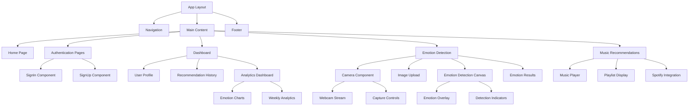

# Moodify Frontend Design

## Overview

This document outlines the frontend architecture for **Moodify**, a music recommendation web application built with Next.js that uses facial emotion recognition to suggest music based on the user's current emotional state.

### Core Features
- Facial emotion detection through camera capture or image upload
- Music recommendations based on detected emotions
- User authentication and account management
- Recommendation history storage and access
- Dashboard with emotion analytics (bonus feature)
- Integration with Spotify API for music recommendations
- Responsive design for various devices

## Technology Stack & Dependencies

### Core Framework
- **Next.js 14+**: React framework with App Router for SSR/SSG capabilities
- **React 18+**: UI library with hooks and modern patterns
- **TypeScript**: Type safety and enhanced developer experience

### Emotion Recognition
- **face-api.js**: Machine learning library for facial emotion detection
- **react-webcam**: React component for camera access and video streaming
- **AWS Rekognition**: Cloud-based emotion analysis (alternative/enhancement)

### Music Integration
- **Spotify Web API**: Music streaming and recommendation service
- **Spotify Web Playback SDK**: In-browser music playback

### Authentication
- **Auth.js (NextAuth.js)**: Authentication solution with multiple providers
- **@auth/prisma-adapter**: Database adapter for user sessions

### UI & Styling
- **Tailwind CSS**: Utility-first CSS framework
- **Headless UI**: Unstyled, accessible UI components
- **React Hook Form**: Form handling with validation
- **Zod**: Schema validation

### Additional Dependencies
- **Canvas API**: Image processing and emotion data extraction
- **File API**: Image upload and processing
- **Chart.js/Recharts**: Dashboard analytics visualization
- **IndexedDB/localStorage**: Client-side caching for recommendations
- **Axios**: HTTP client for API communications

## Component Architecture

### Component Hierarchy



### Core Components

#### 1. Camera Component (`/components/Camera/EmotionCapture.tsx`)

```typescript
interface EmotionCaptureProps {
  onEmotionDetected: (emotion: EmotionData) => void;
  onImageCapture: (imageData: string) => void;
  isActive: boolean;
  mode: 'camera' | 'upload';
}
```

**Features:**
- Real-time webcam streaming
- Emotion detection overlay
- Image capture functionality
- Image upload support

#### 2. Emotion Detection Canvas (`/components/Emotion/DetectionCanvas.tsx`)

```typescript
interface EmotionCanvasProps {
  videoRef: React.RefObject<HTMLVideoElement>;
  emotions: EmotionDetection[];
  showConfidence: boolean;
}
```

**Features:**
- Overlay emotion indicators
- Display confidence scores
- Real-time emotion tracking
- Visual feedback for detected emotions

#### 3. Authentication Components

```typescript
// SignIn Component
interface SignInProps {
  providers: Provider[];
  callbackUrl?: string;
}

// Protected Route Wrapper
interface ProtectedRouteProps {
  children: React.ReactNode;
  requiredRole?: 'user' | 'admin';
}
```

#### 4. Music Recommendation Component (`/components/Music/RecommendationDisplay.tsx`)

```typescript
interface MusicRecommendationProps {
  emotion: DetectedEmotion;
  recommendations: SpotifyTrack[];
  onTrackSelect: (track: SpotifyTrack) => void;
  isLoading: boolean;
}
```

**Features:**
- Display emotion-based playlists
- Track preview and selection
- Spotify integration
- Save recommendations to history

#### 5. Dashboard Analytics (`/components/Dashboard/EmotionAnalytics.tsx`)

```typescript
interface AnalyticsDashboardProps {
  user: User;
  emotionHistory: EmotionAnalysis[];
  weeklyData: WeeklyEmotionData;
}
```

**Features:**
- Weekly emotion charts
- Analysis frequency tracking
- Positive vs negative emotion ratios
- Interactive data visualization

## Routing & Navigation

### App Router Structure

```
app/
├── layout.tsx                 # Root layout with providers
├── page.tsx                   # Home page with emotion capture
├── globals.css               # Global styles
│
├── auth/
│   ├── signin/
│   │   └── page.tsx          # Sign in page
│   └── signup/
│       └── page.tsx          # Sign up page
│
├── dashboard/
│   ├── layout.tsx            # Dashboard layout
│   ├── page.tsx              # Main dashboard
│   ├── profile/
│   │   └── page.tsx          # User profile
│   ├── history/
│   │   └── page.tsx          # Recommendation history
│   └── analytics/
│       └── page.tsx          # Emotion analytics (bonus)
│
├── emotion/
│   ├── detect/
│   │   └── page.tsx          # Emotion detection page
│   └── upload/
│       └── page.tsx          # Image upload for analysis
│
├── music/
│   ├── recommendations/
│   │   └── page.tsx          # Music recommendations display
│   └── player/
│       └── page.tsx          # Music player interface
│
└── api/
    ├── auth/
    │   └── [...nextauth]/
    │       └── route.ts      # Auth.js configuration
    ├── emotion/
    │   ├── detect/
    │   │   └── route.ts      # Emotion detection API
    │   └── analyze/
    │       └── route.ts      # Image analysis API
    ├── music/
    │   ├── recommendations/
    │   │   └── route.ts      # Music recommendation API
    │   └── spotify/
    │       └── route.ts      # Spotify integration
    └── users/
        ├── route.ts          # User management
        └── history/
            └── route.ts      # Recommendation history
```

### Navigation Component

```typescript
interface NavigationItem {
  label: string;
  href: string;
  icon: React.ComponentType;
  requiresAuth: boolean;
}

const navigationItems: NavigationItem[] = [
  { label: 'Home', href: '/', icon: HomeIcon, requiresAuth: false },
  { label: 'Detect Emotion', href: '/emotion/detect', icon: CameraIcon, requiresAuth: true },
  { label: 'Dashboard', href: '/dashboard', icon: DashboardIcon, requiresAuth: true },
  { label: 'Music', href: '/music/recommendations', icon: MusicIcon, requiresAuth: true },
  { label: 'Analytics', href: '/dashboard/analytics', icon: ChartIcon, requiresAuth: true },
];
```

## Styling Strategy

### Tailwind CSS Configuration

```typescript
// tailwind.config.js
module.exports = {
  content: ['./app/**/*.{js,ts,jsx,tsx}', './components/**/*.{js,ts,jsx,tsx}'],
  theme: {
    extend: {
      colors: {
        primary: {
          50: '#eff6ff',
          500: '#3b82f6',
          900: '#1e3a8a',
        },
        emotion: {
          happy: '#fbbf24',
          sad: '#3b82f6',
          angry: '#ef4444',
          surprised: '#f59e0b',
          neutral: '#6b7280',
          fear: '#8b5cf6',
          disgust: '#059669',
        },
        music: {
          primary: '#1db954', // Spotify green
          secondary: '#191414', // Spotify black
          accent: '#1ed760',
        }
      },
      animation: {
        'pulse-slow': 'pulse 3s cubic-bezier(0.4, 0, 0.6, 1) infinite',
        'emotion-glow': 'emotion-glow 2s ease-in-out infinite',
        'music-wave': 'music-wave 1.5s ease-in-out infinite',
      }
    },
  },
  plugins: [require('@tailwindcss/forms')],
}
```

### Component Styling Patterns

```typescript
// Styling utilities for emotion detection and music UI
const emotionStyles = {
  overlay: "absolute inset-0 pointer-events-none",
  emotionIndicator: "absolute bg-gradient-to-r from-emotion-happy to-emotion-sad text-white px-3 py-2 text-sm rounded-full",
  confidence: "absolute bg-black bg-opacity-75 text-white px-2 py-1 text-xs rounded",
  emotionGlow: "absolute inset-0 rounded-lg animate-emotion-glow",
};

const cameraStyles = {
  container: "relative w-full max-w-2xl mx-auto",
  video: "w-full h-auto rounded-lg shadow-lg",
  controls: "absolute bottom-4 left-1/2 transform -translate-x-1/2",
  captureButton: "bg-music-primary hover:bg-music-accent text-white rounded-full p-4 transition-colors",
  uploadArea: "border-2 border-dashed border-gray-300 rounded-lg p-8 text-center hover:border-music-primary transition-colors",
};

const musicPlayerStyles = {
  container: "bg-music-secondary text-white rounded-lg p-6",
  trackCard: "bg-gray-800 rounded-lg p-4 hover:bg-gray-700 transition-colors cursor-pointer",
  playButton: "bg-music-primary hover:bg-music-accent rounded-full p-3 transition-colors",
  progressBar: "w-full bg-gray-600 rounded-full h-2",
  waveform: "flex items-end space-x-1 animate-music-wave",
};
```

## State Management

### Context Providers

#### 1. Emotion Detection Context

```typescript
interface EmotionDetectionContextType {
  // Models and initialization
  modelsLoaded: boolean;
  loadingProgress: number;
  initializeEmotionAPI: () => Promise<void>;
  
  // Emotion detection
  isDetecting: boolean;
  detectedEmotions: EmotionDetection[];
  currentEmotion: DetectedEmotion | null;
  startDetection: () => void;
  stopDetection: () => void;
  
  // Image analysis
  analyzeImage: (imageData: string) => Promise<EmotionAnalysisResult>;
  
  // Settings
  detectionSettings: EmotionDetectionSettings;
  updateSettings: (settings: Partial<EmotionDetectionSettings>) => void;
}
```

#### 2. Music Recommendation Context

```typescript
interface MusicContextType {
  // Spotify integration
  isSpotifyConnected: boolean;
  connectSpotify: () => Promise<void>;
  spotifyToken: string | null;
  
  // Recommendations
  currentRecommendations: SpotifyTrack[];
  isLoadingRecommendations: boolean;
  getRecommendations: (emotion: DetectedEmotion) => Promise<SpotifyTrack[]>;
  
  // Playback
  currentTrack: SpotifyTrack | null;
  isPlaying: boolean;
  playTrack: (track: SpotifyTrack) => void;
  pauseTrack: () => void;
  
  // History
  recommendationHistory: RecommendationHistory[];
  saveToHistory: (emotion: DetectedEmotion, tracks: SpotifyTrack[]) => void;
}
```

#### 3. Analytics Context

```typescript
interface AnalyticsContextType {
  // Weekly data
  weeklyEmotions: WeeklyEmotionData;
  dailyAnalyses: DailyAnalysisCount[];
  emotionRatio: EmotionRatio;
  
  // Data fetching
  isLoadingAnalytics: boolean;
  fetchWeeklyData: () => Promise<void>;
  
  // Real-time tracking
  trackEmotionAnalysis: (emotion: DetectedEmotion) => void;
  getEmotionTrends: () => EmotionTrend[];
}
```

#### 2. Camera Context

```typescript
interface CameraContextType {
  // Camera state
  isActive: boolean;
  stream: MediaStream | null;
  videoRef: React.RefObject<HTMLVideoElement>;
  
  // Camera controls
  startCamera: () => Promise<void>;
  stopCamera: () => void;
  captureImage: () => string | null;
  
  // Camera settings
  deviceId: string;
  availableDevices: MediaDeviceInfo[];
  switchDevice: (deviceId: string) => void;
  
  // Permissions
  hasPermission: boolean;
  requestPermission: () => Promise<boolean>;
}
```

### Custom Hooks

#### useEmotionDetection Hook

```typescript
interface UseEmotionDetectionOptions {
  interval?: number;
  minConfidence?: number;
  enableRealTime?: boolean;
}

interface UseEmotionDetectionReturn {
  emotions: EmotionDetection[];
  currentEmotion: DetectedEmotion | null;
  isDetecting: boolean;
  confidence: number;
  startDetection: (video: HTMLVideoElement) => void;
  stopDetection: () => void;
  analyzeImage: (imageData: string) => Promise<EmotionAnalysisResult>;
  error: string | null;
}

const useEmotionDetection = (options: UseEmotionDetectionOptions): UseEmotionDetectionReturn;
```

#### useMusicRecommendations Hook

```typescript
interface UseMusicRecommendationsReturn {
  recommendations: SpotifyTrack[];
  isLoading: boolean;
  currentPlaylist: SpotifyPlaylist | null;
  getRecommendationsForEmotion: (emotion: DetectedEmotion) => Promise<void>;
  saveRecommendation: (track: SpotifyTrack, emotion: DetectedEmotion) => void;
  history: RecommendationHistory[];
}

const useMusicRecommendations = (): UseMusicRecommendationsReturn;
```

#### useSpotifyPlayer Hook

```typescript
interface UseSpotifyPlayerReturn {
  isConnected: boolean;
  currentTrack: SpotifyTrack | null;
  isPlaying: boolean;
  volume: number;
  connect: () => Promise<void>;
  playTrack: (trackId: string) => Promise<void>;
  pauseTrack: () => void;
  setVolume: (volume: number) => void;
  skipTrack: () => void;
}

const useSpotifyPlayer = (): UseSpotifyPlayerReturn;
```

## API Integration Layer

### API Client Configuration

```typescript
// lib/api-client.ts
class MoodifyAPIClient {
  private baseURL: string;
  
  constructor(baseURL: string) {
    this.baseURL = baseURL;
  }
  
  async analyzeEmotion(data: EmotionAnalysisData): Promise<EmotionAnalysisResponse> {
    const response = await fetch(`${this.baseURL}/api/emotion/analyze`, {
      method: 'POST',
      headers: { 'Content-Type': 'application/json' },
      body: JSON.stringify(data),
    });
    return response.json();
  }
  
  async getMusicRecommendations(emotion: DetectedEmotion): Promise<MusicRecommendationResponse> {
    const response = await fetch(`${this.baseURL}/api/music/recommendations`, {
      method: 'POST',
      headers: { 'Content-Type': 'application/json' },
      body: JSON.stringify({ emotion }),
    });
    return response.json();
  }
  
  async saveRecommendationHistory(data: RecommendationHistoryData): Promise<void> {
    await fetch(`${this.baseURL}/api/users/history`, {
      method: 'POST',
      headers: { 'Content-Type': 'application/json' },
      body: JSON.stringify(data),
    });
  }
  
  async getWeeklyAnalytics(userId: string): Promise<WeeklyAnalyticsResponse> {
    const response = await fetch(`${this.baseURL}/api/users/analytics?userId=${userId}`);
    return response.json();
  }
}
```

### Data Models

```typescript
interface EmotionDetection {
  emotion: EmotionType;
  confidence: number;
  timestamp: Date;
  boundingBox?: BoundingBox;
}

interface DetectedEmotion {
  primary: EmotionType;
  confidence: number;
  secondary?: EmotionType;
  analysis: EmotionAnalysisDetails;
}

interface SpotifyTrack {
  id: string;
  name: string;
  artists: SpotifyArtist[];
  album: SpotifyAlbum;
  preview_url: string;
  external_urls: {
    spotify: string;
  };
  duration_ms: number;
}

interface RecommendationHistory {
  id: string;
  userId: string;
  emotion: DetectedEmotion;
  tracks: SpotifyTrack[];
  timestamp: Date;
  imageData?: string;
}

interface EmotionAnalysisData {
  imageData: string; // Base64 encoded image
  userId: string;
  source: 'camera' | 'upload';
  metadata: AnalysisMetadata;
}

interface WeeklyEmotionData {
  emotions: { [key in EmotionType]: number };
  dailyCounts: DailyAnalysisCount[];
  positiveRatio: number;
  negativeRatio: number;
  totalAnalyses: number;
}

interface DailyAnalysisCount {
  date: string;
  count: number;
  dominantEmotion: EmotionType;
}

type EmotionType = 'happy' | 'sad' | 'angry' | 'surprised' | 'neutral' | 'fear' | 'disgust';
```

## Testing Strategy

### Unit Testing with Jest

```typescript
// Component testing patterns
describe('EmotionCapture Component', () => {
  test('should request camera permission on mount', async () => {
    const mockGetUserMedia = jest.fn().mockResolvedValue(mockStream);
    Object.defineProperty(navigator, 'mediaDevices', {
      value: { getUserMedia: mockGetUserMedia },
    });
    
    render(<EmotionCapture onEmotionDetected={jest.fn()} />);
    
    await waitFor(() => {
      expect(mockGetUserMedia).toHaveBeenCalledWith({
        video: { width: 640, height: 480 },
        audio: false,
      });
    });
  });
  
  test('should detect emotions from captured image', async () => {
    const mockEmotionDetected = jest.fn();
    const mockImageData = 'data:image/jpeg;base64,/9j/4AAQSkZJRgABAQEASA...';
    
    render(<EmotionCapture onEmotionDetected={mockEmotionDetected} />);
    
    const uploadInput = screen.getByLabelText(/upload image/i);
    const file = new File([mockImageData], 'test.jpg', { type: 'image/jpeg' });
    
    await userEvent.upload(uploadInput, file);
    
    await waitFor(() => {
      expect(mockEmotionDetected).toHaveBeenCalledWith(
        expect.objectContaining({
          primary: expect.any(String),
          confidence: expect.any(Number),
        })
      );
    });
  });
});

// Hook testing
describe('useEmotionDetection Hook', () => {
  test('should detect emotions when video is provided', async () => {
    const { result } = renderHook(() => useEmotionDetection());
    const mockVideo = document.createElement('video');
    
    act(() => {
      result.current.startDetection(mockVideo);
    });
    
    await waitFor(() => {
      expect(result.current.isDetecting).toBe(true);
    });
  });
});

describe('useMusicRecommendations Hook', () => {
  test('should fetch recommendations based on emotion', async () => {
    const { result } = renderHook(() => useMusicRecommendations());
    const mockEmotion: DetectedEmotion = {
      primary: 'happy',
      confidence: 0.9,
      analysis: {} as EmotionAnalysisDetails,
    };
    
    await act(async () => {
      await result.current.getRecommendationsForEmotion(mockEmotion);
    });
    
    expect(result.current.recommendations).toHaveLength(10);
    expect(result.current.recommendations[0]).toHaveProperty('name');
  });
});
```

### Integration Testing with Testing Library

```typescript
// Page testing
describe('Emotion Detection Page', () => {
  test('should complete emotion analysis and show music recommendations', async () => {
    const user = userEvent.setup();
    
    render(<EmotionDetectionPage />);
    
    // Start camera
    const startButton = screen.getByRole('button', { name: /start camera/i });
    await user.click(startButton);
    
    // Capture emotion
    const captureButton = screen.getByRole('button', { name: /capture emotion/i });
    await user.click(captureButton);
    
    // Wait for emotion analysis
    await waitFor(() => screen.getByText(/emotion detected/i));
    
    // Verify emotion display
    expect(screen.getByTestId('detected-emotion')).toBeInTheDocument();
    
    // Get music recommendations
    const recommendButton = screen.getByRole('button', { name: /get music recommendations/i });
    await user.click(recommendButton);
    
    // Verify recommendations
    await waitFor(() => screen.getByText(/recommended tracks/i));
    expect(screen.getAllByTestId('track-card')).toHaveLength.greaterThan(0);
  });
});

describe('Analytics Dashboard Page', () => {
  test('should display weekly emotion analytics', async () => {
    const mockAnalytics = {
      emotions: { happy: 40, sad: 20, neutral: 30, angry: 10 },
      dailyCounts: [
        { date: '2024-01-01', count: 5, dominantEmotion: 'happy' },
        { date: '2024-01-02', count: 3, dominantEmotion: 'neutral' },
      ],
      positiveRatio: 0.7,
      negativeRatio: 0.3,
      totalAnalyses: 25,
    };
    
    // Mock API response
    jest.spyOn(global, 'fetch').mockResolvedValue({
      json: () => Promise.resolve(mockAnalytics),
    } as Response);
    
    render(<AnalyticsDashboard />);
    
    // Verify charts are rendered
    await waitFor(() => {
      expect(screen.getByTestId('emotion-pie-chart')).toBeInTheDocument();
      expect(screen.getByTestId('daily-analysis-chart')).toBeInTheDocument();
      expect(screen.getByTestId('emotion-ratio-chart')).toBeInTheDocument();
    });
    
    // Verify data display
    expect(screen.getByText('25 total analyses')).toBeInTheDocument();
    expect(screen.getByText('70% positive emotions')).toBeInTheDocument();
  });
});
```

### E2E Testing with Playwright

```typescript
// e2e/emotion-detection.spec.ts
test('complete emotion detection and music recommendation flow', async ({ page, context }) => {
  // Grant camera permissions
  await context.grantPermissions(['camera']);
  
  await page.goto('/emotion/detect');
  
  // Start camera
  await page.click('[data-testid="start-camera"]');
  
  // Capture emotion
  await page.click('[data-testid="capture-emotion"]');
  
  // Wait for emotion detection
  await page.waitForSelector('[data-testid="emotion-detected"]');
  
  // Verify emotion display
  const emotionElement = page.locator('[data-testid="detected-emotion"]');
  await expect(emotionElement).toBeVisible();
  
  // Get music recommendations
  await page.click('[data-testid="get-recommendations"]');
  
  // Verify music recommendations
  await page.waitForSelector('[data-testid="music-recommendations"]');
  const trackCards = page.locator('[data-testid="track-card"]');
  await expect(trackCards).toHaveCount.greaterThan(0);
  
  // Play a track
  await trackCards.first().click();
  
  // Verify music player
  const musicPlayer = page.locator('[data-testid="music-player"]');
  await expect(musicPlayer).toBeVisible();
});

test('analytics dashboard functionality', async ({ page }) => {
  await page.goto('/dashboard/analytics');
  
  // Wait for charts to load
  await page.waitForSelector('[data-testid="emotion-analytics"]');
  
  // Verify chart elements
  await expect(page.locator('[data-testid="emotion-pie-chart"]')).toBeVisible();
  await expect(page.locator('[data-testid="daily-analysis-chart"]')).toBeVisible();
  await expect(page.locator('[data-testid="emotion-ratio-chart"]')).toBeVisible();
  
  // Check data filters
  await page.selectOption('[data-testid="time-filter"]', 'last-week');
  await page.waitForTimeout(1000); // Wait for data refresh
  
  // Verify updated data
  const totalAnalyses = page.locator('[data-testid="total-analyses"]');
  await expect(totalAnalyses).toContainText('analyses');
});
```

## Architecture Patterns

### Emotion API Integration Pattern

```typescript
// services/emotion-api.service.ts
class EmotionAPIService {
  private static instance: EmotionAPIService;
  private modelsLoaded = false;
  
  static getInstance(): EmotionAPIService {
    if (!EmotionAPIService.instance) {
      EmotionAPIService.instance = new EmotionAPIService();
    }
    return EmotionAPIService.instance;
  }
  
  async loadModels(): Promise<void> {
    if (this.modelsLoaded) return;
    
    await Promise.all([
      faceapi.nets.tinyFaceDetector.loadFromUri('/models'),
      faceapi.nets.faceExpressionNet.loadFromUri('/models'),
      faceapi.nets.faceLandmark68Net.loadFromUri('/models'),
    ]);
    
    this.modelsLoaded = true;
  }
  
  async detectEmotion(input: HTMLVideoElement | HTMLImageElement): Promise<EmotionDetection[]> {
    if (!this.modelsLoaded) await this.loadModels();
    
    const detections = await faceapi
      .detectAllFaces(input, new faceapi.TinyFaceDetectorOptions())
      .withFaceExpressions();
      
    return detections.map(detection => ({
      emotion: this.getPrimaryEmotion(detection.expressions),
      confidence: this.getConfidence(detection.expressions),
      timestamp: new Date(),
      boundingBox: detection.detection.box,
    }));
  }
  
  private getPrimaryEmotion(expressions: any): EmotionType {
    const emotions = Object.entries(expressions) as [EmotionType, number][];
    return emotions.reduce((prev, current) => 
      current[1] > prev[1] ? current : prev
    )[0];
  }
}
```

### Spotify Integration Pattern

```typescript
// services/spotify.service.ts
class SpotifyService {
  private accessToken: string | null = null;
  private readonly CLIENT_ID = process.env.NEXT_PUBLIC_SPOTIFY_CLIENT_ID!;
  private readonly REDIRECT_URI = process.env.NEXT_PUBLIC_SPOTIFY_REDIRECT_URI!;
  
  async authenticate(): Promise<string> {
    const scope = 'streaming user-read-email user-read-private';
    const authUrl = `https://accounts.spotify.com/authorize?` +
      `response_type=token&` +
      `client_id=${this.CLIENT_ID}&` +
      `scope=${encodeURIComponent(scope)}&` +
      `redirect_uri=${encodeURIComponent(this.REDIRECT_URI)}`;
    
    window.location.href = authUrl;
    return authUrl;
  }
  
  async getEmotionBasedRecommendations(emotion: EmotionType): Promise<SpotifyTrack[]> {
    if (!this.accessToken) throw new Error('Not authenticated with Spotify');
    
    const seedGenres = this.getGenresForEmotion(emotion);
    const audioFeatures = this.getAudioFeaturesForEmotion(emotion);
    
    const response = await fetch(
      `https://api.spotify.com/v1/recommendations?` +
      `seed_genres=${seedGenres.join(',')}&` +
      `target_valence=${audioFeatures.valence}&` +
      `target_energy=${audioFeatures.energy}&` +
      `target_danceability=${audioFeatures.danceability}&` +
      `limit=20`,
      {
        headers: {
          'Authorization': `Bearer ${this.accessToken}`,
        },
      }
    );
    
    const data = await response.json();
    return data.tracks;
  }
  
  private getGenresForEmotion(emotion: EmotionType): string[] {
    const emotionGenreMap: Record<EmotionType, string[]> = {
      happy: ['pop', 'dance', 'funk', 'reggae'],
      sad: ['indie', 'folk', 'blues', 'acoustic'],
      angry: ['metal', 'punk', 'rock', 'hardcore'],
      surprised: ['electronic', 'edm', 'house'],
      neutral: ['chill', 'ambient', 'jazz'],
      fear: ['dark-ambient', 'industrial'],
      disgust: ['experimental', 'noise'],
    };
    
    return emotionGenreMap[emotion] || ['pop'];
  }
  
  private getAudioFeaturesForEmotion(emotion: EmotionType): AudioFeatures {
    const featureMap: Record<EmotionType, AudioFeatures> = {
      happy: { valence: 0.8, energy: 0.7, danceability: 0.8 },
      sad: { valence: 0.2, energy: 0.3, danceability: 0.3 },
      angry: { valence: 0.3, energy: 0.9, danceability: 0.5 },
      surprised: { valence: 0.6, energy: 0.8, danceability: 0.7 },
      neutral: { valence: 0.5, energy: 0.5, danceability: 0.5 },
      fear: { valence: 0.1, energy: 0.4, danceability: 0.2 },
      disgust: { valence: 0.2, energy: 0.6, danceability: 0.3 },
    };
    
    return featureMap[emotion];
  }
}
```

### Performance Optimization Patterns

```typescript
// hooks/useOptimizedEmotionDetection.ts
const useOptimizedEmotionDetection = (videoRef: RefObject<HTMLVideoElement>) => {
  const [emotions, setEmotions] = useState<EmotionDetection[]>([]);
  const detectionTimeoutRef = useRef<NodeJS.Timeout>();
  const lastDetectionRef = useRef<number>(0);
  const emotionHistoryRef = useRef<EmotionDetection[]>([]);
  
  const optimizedDetect = useCallback(async () => {
    const now = Date.now();
    const timeSinceLastDetection = now - lastDetectionRef.current;
    
    // Throttle detection to 5 FPS for performance
    if (timeSinceLastDetection < 200) return;
    
    if (videoRef.current && videoRef.current.readyState === 4) {
      const results = await EmotionAPIService.getInstance().detectEmotion(videoRef.current);
      
      // Smooth emotion transitions
      const smoothedResults = smoothEmotionTransitions(results, emotionHistoryRef.current);
      
      setEmotions(smoothedResults);
      emotionHistoryRef.current = [...emotionHistoryRef.current, ...smoothedResults].slice(-10);
      lastDetectionRef.current = now;
    }
    
    detectionTimeoutRef.current = setTimeout(optimizedDetect, 200);
  }, [videoRef]);
  
  const smoothEmotionTransitions = (
    newEmotions: EmotionDetection[],
    history: EmotionDetection[]
  ): EmotionDetection[] => {
    if (history.length === 0) return newEmotions;
    
    // Apply temporal smoothing to reduce flickering
    return newEmotions.map(emotion => {
      const recentSimilar = history
        .slice(-3)
        .filter(h => h.emotion === emotion.emotion);
        
      if (recentSimilar.length >= 2) {
        // Boost confidence for consistent emotions
        return {
          ...emotion,
          confidence: Math.min(emotion.confidence * 1.2, 1.0),
        };
      }
      
      return emotion;
    });
  };
  
  useEffect(() => {
    return () => {
      if (detectionTimeoutRef.current) {
        clearTimeout(detectionTimeoutRef.current);
      }
    };
  }, []);
  
  return { emotions, startOptimizedDetection: optimizedDetect };
};
```

### Analytics Data Processing

```typescript
// services/analytics.service.ts
class AnalyticsService {
  static processWeeklyEmotionData(emotionHistory: EmotionDetection[]): WeeklyEmotionData {
    const weekAgo = new Date(Date.now() - 7 * 24 * 60 * 60 * 1000);
    const weeklyData = emotionHistory.filter(e => e.timestamp >= weekAgo);
    
    // Count emotions
    const emotionCounts = weeklyData.reduce((acc, detection) => {
      acc[detection.emotion] = (acc[detection.emotion] || 0) + 1;
      return acc;
    }, {} as Record<EmotionType, number>);
    
    // Calculate daily counts
    const dailyCounts = this.groupByDay(weeklyData);
    
    // Calculate positive/negative ratios
    const positiveEmotions = ['happy', 'surprised'];
    const negativeEmotions = ['sad', 'angry', 'fear', 'disgust'];
    
    const totalPositive = positiveEmotions.reduce(
      (sum, emotion) => sum + (emotionCounts[emotion as EmotionType] || 0), 0
    );
    const totalNegative = negativeEmotions.reduce(
      (sum, emotion) => sum + (emotionCounts[emotion as EmotionType] || 0), 0
    );
    const total = totalPositive + totalNegative + (emotionCounts.neutral || 0);
    
    return {
      emotions: emotionCounts,
      dailyCounts,
      positiveRatio: total > 0 ? totalPositive / total : 0,
      negativeRatio: total > 0 ? totalNegative / total : 0,
      totalAnalyses: total,
    };
  }
  
  private static groupByDay(data: EmotionDetection[]): DailyAnalysisCount[] {
    const grouped = data.reduce((acc, detection) => {
      const date = detection.timestamp.toISOString().split('T')[0];
      if (!acc[date]) {
        acc[date] = [];
      }
      acc[date].push(detection);
      return acc;
    }, {} as Record<string, EmotionDetection[]>);
    
    return Object.entries(grouped).map(([date, detections]) => {
      const emotionCounts = detections.reduce((acc, d) => {
        acc[d.emotion] = (acc[d.emotion] || 0) + 1;
        return acc;
      }, {} as Record<EmotionType, number>);
      
      const dominantEmotion = Object.entries(emotionCounts).reduce(
        (prev, current) => current[1] > prev[1] ? current : prev
      )[0] as EmotionType;
      
      return {
        date,
        count: detections.length,
        dominantEmotion,
      };
    }).sort((a, b) => a.date.localeCompare(b.date));
  }
}
  await expect(page.locator('[data-testid="emotion-pie-chart"]')).toBeVisible();
  await expect(page.locator('[data-testid="daily-analysis-chart"]')).toBeVisible();
  await expect(page.locator('[data-testid="emotion-ratio-chart"]')).toBeVisible();
  
  // Check data filters
  await page.selectOption('[data-testid="time-filter"]', 'last-week');
  await page.waitForTimeout(1000); // Wait for data refresh
  
  // Verify updated data
  const totalAnalyses = page.locator('[data-testid="total-analyses"]');
  await expect(totalAnalyses).toContainText('analyses');
});
```

## Architecture Patterns

### Face API Integration Pattern

```typescript
// services/face-api.service.ts
class FaceAPIService {
  private static instance: FaceAPIService;
  private modelsLoaded = false;
  
  static getInstance(): FaceAPIService {
    if (!FaceAPIService.instance) {
      FaceAPIService.instance = new FaceAPIService();
    }
    return FaceAPIService.instance;
  }
  
  async loadModels(): Promise<void> {
    if (this.modelsLoaded) return;
    
    await Promise.all([
      faceapi.nets.tinyFaceDetector.loadFromUri('/models'),
      faceapi.nets.faceLandmark68Net.loadFromUri('/models'),
      faceapi.nets.faceRecognitionNet.loadFromUri('/models'),
    ]);
    
    this.modelsLoaded = true;
  }
  
  async detectFaces(video: HTMLVideoElement): Promise<FaceDetection[]> {
    if (!this.modelsLoaded) await this.loadModels();
    
    return await faceapi
      .detectAllFaces(video, new faceapi.TinyFaceDetectorOptions())
      .withFaceLandmarks()
      .withFaceDescriptors();
  }
}
```

### Error Boundary Pattern

```typescript
// components/ErrorBoundary/FaceRecognitionErrorBoundary.tsx
interface ErrorBoundaryState {
  hasError: boolean;
  error: Error | null;
  errorInfo: string | null;
}

class FaceRecognitionErrorBoundary extends Component<
  PropsWithChildren<{}>,
  ErrorBoundaryState
> {
  constructor(props: PropsWithChildren<{}>) {
    super(props);
    this.state = { hasError: false, error: null, errorInfo: null };
  }
  
  static getDerivedStateFromError(error: Error): ErrorBoundaryState {
    return { hasError: true, error, errorInfo: error.stack || null };
  }
  
  componentDidCatch(error: Error, errorInfo: ErrorInfo) {
    console.error('Face Recognition Error:', error, errorInfo);
    // Send to error reporting service
  }
  
  render() {
    if (this.state.hasError) {
      return (
        <FaceRecognitionErrorFallback
          error={this.state.error}
          onRetry={() => this.setState({ hasError: false, error: null })}
        />
      );
    }
    
    return this.props.children;
  }
}
```

### Performance Optimization Patterns

```typescript
// hooks/useOptimizedDetection.ts
const useOptimizedDetection = (videoRef: RefObject<HTMLVideoElement>) => {
  const [detections, setDetections] = useState<FaceDetection[]>([]);
  const detectionTimeoutRef = useRef<NodeJS.Timeout>();
  const lastDetectionRef = useRef<number>(0);
  
  const optimizedDetect = useCallback(async () => {
    const now = Date.now();
    const timeSinceLastDetection = now - lastDetectionRef.current;
    
    // Throttle detection to 10 FPS
    if (timeSinceLastDetection < 100) return;
    
    if (videoRef.current && videoRef.current.readyState === 4) {
      const results = await FaceAPIService.getInstance().detectFaces(videoRef.current);
      setDetections(results);
      lastDetectionRef.current = now;
    }
    
    detectionTimeoutRef.current = setTimeout(optimizedDetect, 100);
  }, [videoRef]);
  
  useEffect(() => {
    return () => {
      if (detectionTimeoutRef.current) {
        clearTimeout(detectionTimeoutRef.current);
      }
    };
  }, []);
  
  return { detections, startOptimizedDetection: optimizedDetect };
};
```