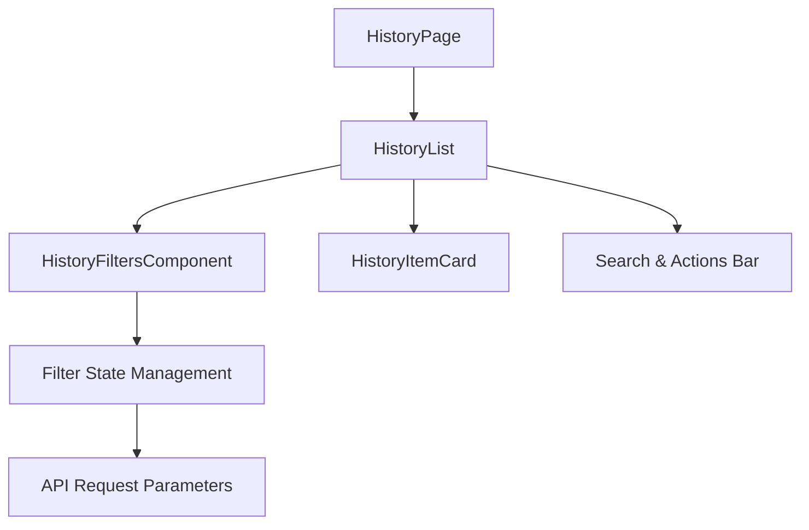
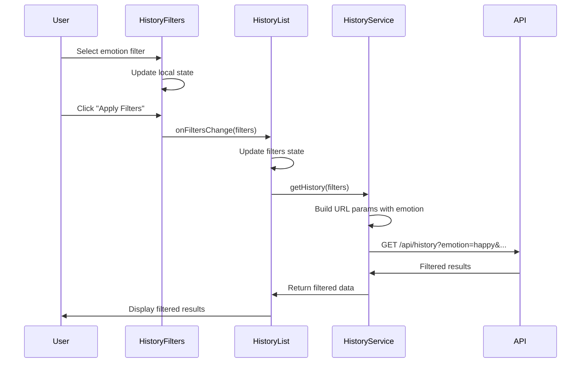
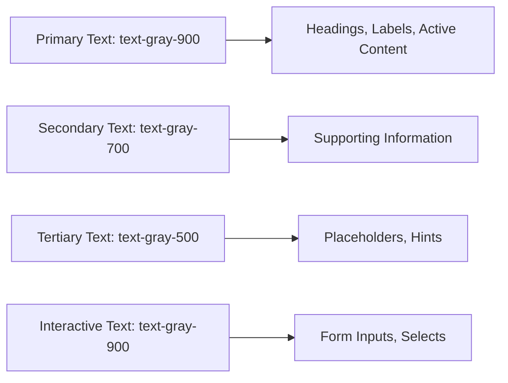
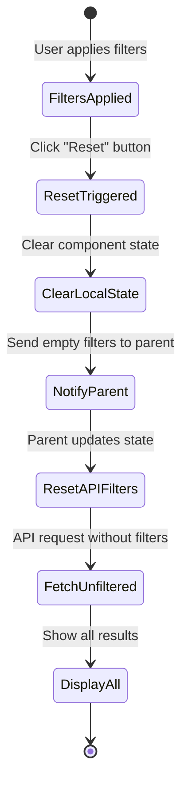
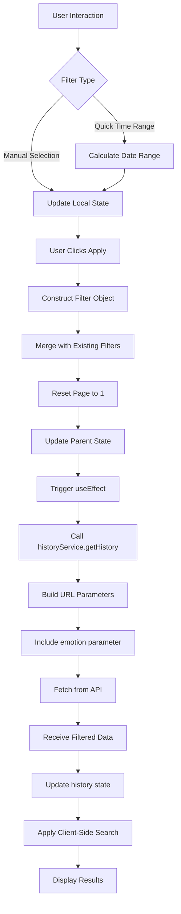

# Filter Functionality and Text Color Adjustment

## Overview

The history page contains two primary issues that need resolution:
1. **Filter functionality is not working correctly** - Filters defined in HistoryFilters component are not being applied to the actual data retrieval
2. **Text visibility issues** - Gray text on white backgrounds creates poor readability

This design addresses both problems by correcting the filter parameter passing mechanism and improving text contrast throughout the history interface.

## Architecture

### Component Hierarchy

### Current Problem Analysis

#### Filter Flow Issues

| Component | Current Behavior | Expected Behavior |
|-----------|-----------------|-------------------|
| HistoryFilters | Stores local filter state including emotion filter | Should pass emotion filter to parent |
| HistoryList | Receives filters but doesn't process emotion filter | Should include emotion filter in API request |
| historyService.getHistory() | Only processes type, startDate, endDate, limit, page | Should also process emotion parameter |

#### Text Color Issues

| Element | Current Color | Visibility Issue | Required Color |
|---------|--------------|------------------|----------------|
| Filter dropdown options | text-gray-500 or default | Low contrast on white | text-gray-900 |
| Filter labels | text-gray-700 | Acceptable but could improve | text-gray-900 |
| Input placeholders | text-gray-400 | Acceptable for placeholders | text-gray-500 |
| Input text | text-gray-600 or default | Low contrast | text-gray-900 |

## Filter Functionality Enhancement

### Filter Parameter Flow

### Filter State Structure

The filter state should include all parameters that can be used to narrow results:

| Filter Parameter | Data Type | Purpose | Default Value |
|-----------------|-----------|---------|---------------|
| type | 'emotion' \| 'recommendation' \| undefined | Filter by entry type | undefined |
| emotion | EmotionType \| undefined | Filter by specific emotion | undefined |
| startDate | Date \| undefined | Beginning of date range | undefined |
| endDate | Date \| undefined | End of date range | undefined |
| limit | number | Results per page | 20 |
| page | number | Current page number | 1 |

### Filter Application Strategy

When user applies filters:

1. **Local State Update**: HistoryFilters component updates internal state immediately for UI responsiveness
2. **Parent Notification**: On "Apply Filters" button click, component notifies parent (HistoryList) with complete filter object
3. **State Merge**: HistoryList merges new filters with existing state
4. **Page Reset**: Pagination is reset to page 1 when filters change
5. **API Request**: Updated filter state triggers useEffect to call historyService.getHistory()
6. **Parameter Serialization**: historyService converts filter object to URL query parameters
7. **Response Handling**: Filtered results replace current history display

### Missing Emotion Filter Integration

#### Current Implementation Gap

The emotion filter is collected in HistoryFilters component but never transmitted to the API:

- HistoryFilters maintains `localFilters.emotion` in component state
- `handleApplyFilters()` function does not include emotion in the returned filter object
- historyService.getHistory() does not serialize emotion parameter to URL
- Backend API receives no emotion filter parameter

#### Required Changes

**Filter Transmission Enhancement**

The `handleApplyFilters()` function in HistoryFilters component should construct a complete filter object:

| Field | Transformation | Purpose |
|-------|---------------|---------|
| type | Remove 'all' option, convert to undefined | Avoid sending redundant filter |
| emotion | Pass through if selected, undefined if empty | Enable emotion-based filtering |
| startDate | Convert string to Date object | API compatibility |
| endDate | Convert string to Date object | API compatibility |
| limit | Pass through as number | Control page size |
| page | Always reset to 1 | Start fresh with new filters |

**API Parameter Serialization**

The historyService.getHistory() method should serialize the emotion parameter to the API request:

| Parameter | URL Query Format | Example |
|-----------|-----------------|---------|
| emotion | emotion={value} | emotion=happy |
| type | type={value} | type=emotion |
| startDate | startDate={ISO string} | startDate=2024-01-01T00:00:00.000Z |
| endDate | endDate={ISO string} | endDate=2024-12-31T23:59:59.999Z |
| limit | limit={number} | limit=20 |
| page | page={number} | page=1 |

## Text Color and Readability Enhancement

### Visual Hierarchy Strategy

### Component-Level Text Color Specification

#### HistoryFilters Component

| Element | Current Style | Updated Style | Rationale |
|---------|--------------|---------------|-----------|
| Section heading ("Filter Options") | text-gray-900 | text-gray-900 | Already correct |
| Filter labels | text-gray-700 | text-gray-900 | Improve readability |
| Select dropdown text | default (gray) | text-gray-900 | Ensure selected value is clearly visible |
| Select options | default | text-gray-900 | Prevent light gray text in dropdown |
| Date input text | default | text-gray-900 | Match other inputs |
| Button text (Reset) | text-gray-700 | text-gray-900 | Improve contrast |
| Button text (Apply) | text-white | text-white | Already correct (on purple background) |

#### HistoryList Component

| Element | Current Style | Updated Style | Rationale |
|---------|--------------|---------------|-----------|
| Search input text | text-black (already set) | text-gray-900 | Maintain consistency with design system |
| Search placeholder | text-gray-400 | text-gray-500 | Slightly darker for visibility |
| Action button text | text-gray-700 | text-gray-900 | Improve readability |
| Stats card headings | text-gray-900 | text-gray-900 | Already correct |
| "Select all" label | text-gray-700 | text-gray-900 | Improve visibility |
| Empty state message | text-gray-500 | text-gray-600 | Slightly darker for better readability |

### Input Field Styling Consistency

All form inputs (text inputs, selects, date pickers) should use consistent text color:

**Base Input Style Pattern**:
- Text color: `text-gray-900`
- Placeholder color: `text-gray-500`
- Border: `border-gray-300`
- Focus ring: `focus:ring-purple-500`
- Focus border: `focus:border-purple-500`

## Filter Reset Behavior

### Reset Operation Flow

### Reset State Values

When user clicks "Reset" button, all filters return to default values:

| Filter | Reset Value | Effect |
|--------|------------|--------|
| type | 'all' (internal), undefined (API) | Show all entry types |
| emotion | '' (empty string, internal), undefined (API) | Show all emotions |
| startDate | '' (empty string, internal), undefined (API) | No date restriction |
| endDate | '' (empty string, internal), undefined (API) | No date restriction |
| limit | 20 | Default page size |
| page | 1 | Return to first page |

## User Interaction Patterns

### Filter Application Workflow

1. **User opens filter panel**: Clicks "Filters" button in action bar
2. **Filter panel expands**: Shows all available filter options
3. **User selects filters**: Chooses content type, emotion, date range, etc.
4. **Preview not applied**: Filters remain in local state until user confirms
5. **User clicks "Apply Filters"**: Triggers filter application
6. **Loading indicator appears**: Shows data is being fetched
7. **Results update**: Filtered history entries display
8. **Filter panel remains open**: User can adjust and reapply

### Quick Time Range Selection

Predefined time ranges provide convenience:

| Option | Behavior | Start Date Calculation | End Date |
|--------|----------|----------------------|----------|
| All time | Clear date filters | undefined | undefined |
| Last 24 hours | Set 1 day range | now - 1 day | now |
| Last 7 days | Set 7 day range | now - 7 days | now |
| Last 30 days | Set 30 day range | now - 30 days | now |
| Last 3 months | Set 90 day range | now - 90 days | now |
| Last year | Set 365 day range | now - 365 days | now |

When user selects a quick time range:
- startDate and endDate fields auto-populate
- User can still manually adjust dates afterward
- Manual date entry overrides quick selection

## Data Flow Integration

### Complete Filter-to-Display Flow

### Client-Side vs Server-Side Filtering

| Filter Type | Applied Where | Rationale |
|-------------|--------------|-----------|
| Content type (emotion/recommendation) | Server-side | Database query efficiency |
| Emotion filter | Server-side | Database query efficiency |
| Date range | Server-side | Database query efficiency |
| Pagination | Server-side | Reduce data transfer |
| Search query (text search) | Client-side | Real-time feedback, already loaded data |

The search query operates on already-filtered results from the server, providing instant feedback as user types.

## Testing Strategy

### Filter Functionality Validation

| Test Scenario | Expected Outcome | Validation Method |
|---------------|------------------|-------------------|
| Apply emotion filter (happy) | Only happy entries display | Verify all displayed entries have emotion: 'happy' |
| Apply type filter (emotion only) | Only emotion entries display | Verify no recommendation entries present |
| Apply date range | Only entries within range display | Check all entry dates fall within range |
| Combine emotion + type filters | Results match both criteria | Verify logical AND operation |
| Reset filters | All entries display | Verify API request has no filter params |
| Apply then modify filters | Results update correctly | Verify state updates trigger new API calls |

### Text Visibility Validation

| Element | Validation Check | Success Criteria |
|---------|-----------------|------------------|
| Filter labels | Visual contrast ratio | Minimum 4.5:1 contrast ratio |
| Select dropdown text | Visibility against white background | Clearly readable without strain |
| Input field text | Visibility when typing | Dark, clear text appearance |
| Button text | Readability on button background | Appropriate contrast for button color |

### Integration Testing

Test complete user journeys:

1. **Full filter workflow**: Select filters → Apply → View results → Reset → View all results
2. **Filter modification**: Apply filter A → Apply filter B → Verify results match filter B only
3. **Search combined with filters**: Apply filters → Enter search query → Verify both applied
4. **Pagination with filters**: Apply filters → Load more → Verify additional results match filters

## Edge Cases and Error Handling

### Filter Validation

| Edge Case | Handling Strategy |
|-----------|------------------|
| Start date after end date | Allow submission, backend validates and returns error or swaps dates |
| No results match filters | Display "No results found" message with filter summary |
| Invalid emotion value | Client validation prevents invalid selections |
| Extremely large date range | Allow but may return many results (pagination mitigates) |
| Future dates selected | Allow (user may have future entries if data imported) |

### State Consistency

| Scenario | Resolution |
|----------|-----------|
| Filter applied but network error | Show error message, maintain filter state, allow retry |
| User navigates away mid-filter | Filter state preserved in component (lost on unmount) |
| Multiple rapid filter applications | Debounce not required (user must click Apply) |
| Browser back button after filtering | Filters reset (no URL state persistence in current design) |

## Performance Considerations

### Filter Application Optimization

| Optimization | Implementation | Benefit |
|--------------|----------------|---------|
| Server-side filtering | Database queries with WHERE clauses | Reduce data transfer, faster response |
| Pagination | Limit results per request | Prevent large payloads |
| Client-side search on filtered data | Filter already-loaded results in memory | Instant feedback, no additional API calls |
| Single Apply action | User explicitly triggers filter | Prevent excessive API requests during selection |

### Rendering Performance

- Filtered results replace entire history array (no concatenation unless pagination)
- React efficiently re-renders only changed items
- Key prop on mapped items ensures stable identity
- Large datasets handled via pagination (20 items default)