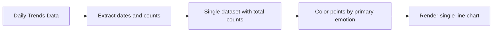
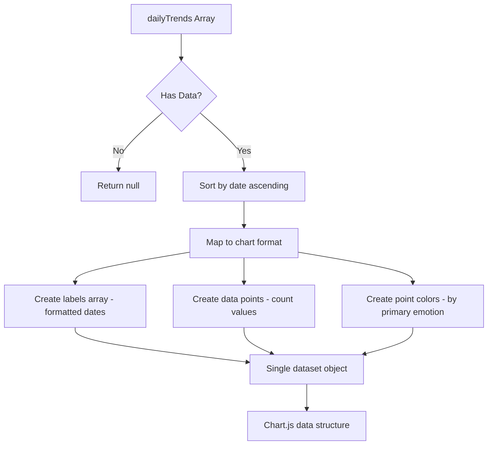
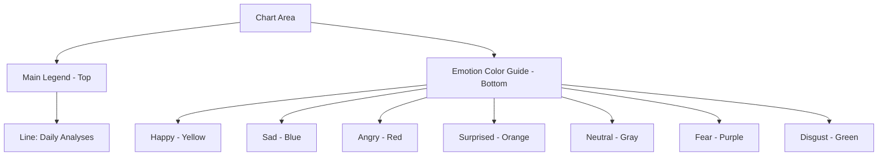
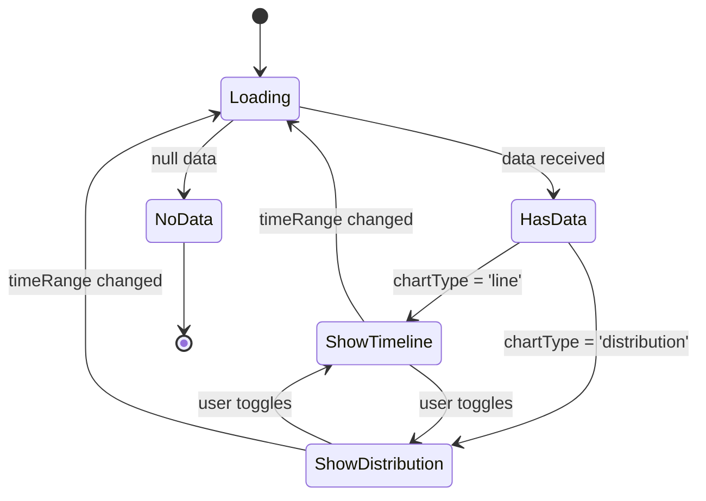

# Fix Emotion Trends Chart Timeline Visualization

## Overview

The EmotionTrendsChart component in the Moodify frontend application has a defect in its timeline visualization mode, while the distribution chart mode functions correctly. The timeline view fails to properly render emotion trends over time, preventing users from visualizing their emotional patterns across days.

**Problem Statement:**  
The line chart (timeline view) in the EmotionTrendsChart component does not display data correctly when users select the "Timeline" view option. This affects the user's ability to track emotional patterns over their selected time range (7 days, 30 days, 3 months, or 1 year).

**Affected Component:**  
`src/components/analytics/EmotionTrendsChart.tsx`

**Impact:**  
- Users cannot view their emotion trends over time in line chart format
- Data visualization is limited to distribution-only view
- Reduces the analytical value of the emotion tracking feature

---

## Root Cause Analysis

### Data Structure Mismatch

The core issue stems from a fundamental mismatch between the API response structure and how the component processes data for the multi-line chart visualization.

**API Response Structure:**

The `/api/history/analytics` endpoint returns `dailyTrends` in the following format:

| Field | Type | Description |
|-------|------|-------------|
| date | string | ISO date string (YYYY-MM-DD) |
| count | number | Total emotion analyses for that day |
| primaryEmotion | EmotionType | The most frequent emotion for that day |

Example:
```
dailyTrends: [
  { date: "2024-01-15", count: 5, primaryEmotion: "happy" },
  { date: "2024-01-16", count: 3, primaryEmotion: "sad" },
  { date: "2024-01-17", count: 4, primaryEmotion: "happy" }
]
```

**Current Component Processing Logic:**

The `generateDailyTrendsData()` function attempts to:
1. Create a map of dates to emotion counts
2. Initialize all emotion types with count 0 for each date
3. Set only the `primaryEmotion` count to the total daily count
4. Generate separate line series for each of the 7 emotion types

**The Problem:**

The API provides only the PRIMARY emotion for each day, not the breakdown of all emotions. The component initializes all emotions to 0, then sets only one emotion to the total count. This results in:

- Each day shows only ONE emotion with a value
- Six other emotions remain at 0
- The chart displays disconnected single points instead of continuous lines
- Most lines appear flat at 0 with occasional spikes

---

## Proposed Solution

### Strategy

Transform the component's data processing approach to align with the actual API data structure while maintaining meaningful visualization.

### Option 1: Single-Line Aggregated Timeline (Recommended)

Display total emotion analyses over time as a single line, with color-coded points representing the primary emotion of each day.

**Rationale:**
- Accurately represents the available data
- Provides clear temporal trends
- Maintains visual clarity
- Eliminates misleading multi-line visualization

**Visual Design:**



### Option 2: Stacked Area Chart

Display the primary emotion distribution as a stacked area over time.

**Rationale:**
- Shows both volume and emotion type
- Familiar visualization pattern
- Better for proportion comparison

### Option 3: Multi-Line with API Enhancement

Modify the backend API to return complete emotion breakdowns per day, then render true multi-line charts.

**Rationale:**
- Most accurate representation
- Aligns with original component intent
- Requires backend changes (out of current scope)

**Recommended Approach:** Option 1 (Single-Line Aggregated Timeline)

---

## Detailed Design: Single-Line Aggregated Timeline

### Data Transformation Flow



### Data Structure Mapping

**Input Structure:**
| Field | Type | Example |
|-------|------|---------|
| dailyTrends[].date | string | "2024-01-15" |
| dailyTrends[].count | number | 5 |
| dailyTrends[].primaryEmotion | EmotionType | "happy" |

**Output Structure for Chart.js:**
| Field | Type | Description |
|-------|------|-------------|
| labels | string[] | Formatted dates (e.g., "Jan 15") |
| datasets[0].label | string | "Emotion Analyses" |
| datasets[0].data | number[] | Daily count values |
| datasets[0].pointBackgroundColor | string[] | Colors mapped from primaryEmotion |
| datasets[0].borderColor | string | Single line color (purple theme) |

### Chart Configuration

**Line Chart Options:**

| Property | Value | Purpose |
|----------|-------|---------|
| tension | 0.4 | Smooth curve for better visual flow |
| borderWidth | 3 | Prominent line visibility |
| pointRadius | 6 | Visible data points |
| pointHoverRadius | 8 | Interactive feedback |
| fill | false | Clean line without area fill |

**Visual Enhancements:**

1. **Point Colors:** Each point colored according to its primary emotion using the `emotionColors` mapping
2. **Tooltips:** Display date, count, and primary emotion name
3. **Responsive Grid:** Adapt to different time ranges without overcrowding

### Component Function Modifications

**Function: generateDailyTrendsData()**

Transform from multi-line to single-line approach:

**Current Logic Flow:**
1. Initialize emotion map for each date
2. Set only primaryEmotion count
3. Generate 7 separate series
4. Create multi-line dataset

**New Logic Flow:**
1. Validate and sort dailyTrends data
2. Extract dates, counts, and primary emotions
3. Format date labels for x-axis
4. Map primary emotions to point colors
5. Create single dataset with colored points
6. Return Chart.js compatible structure

**Pseudo-Logic:**

```
Function generateDailyTrendsData():
  Input: data.dailyTrends (array)
  
  IF dailyTrends is null OR empty:
    RETURN null
  
  // Sort data chronologically
  sortedTrends = dailyTrends.sort by date ascending
  
  // Extract and format labels
  labels = sortedTrends.map(trend => 
    format trend.date as "MMM DD"
  )
  
  // Extract data values
  dataValues = sortedTrends.map(trend => trend.count)
  
  // Map colors for each point
  pointColors = sortedTrends.map(trend =>
    emotionColors[trend.primaryEmotion].primary
  )
  
  // Create dataset
  dataset = {
    label: "Daily Emotion Analyses",
    data: dataValues,
    borderColor: "#9333ea" (purple-600),
    backgroundColor: "#9333ea33" (purple with transparency),
    pointBackgroundColor: pointColors,
    pointBorderColor: pointColors,
    pointRadius: 6,
    pointHoverRadius: 8,
    borderWidth: 3,
    tension: 0.4,
    fill: false
  }
  
  RETURN {
    labels: labels,
    datasets: [dataset]
  }
```

### Tooltip Enhancement

**Tooltip Callback Configuration:**

Display comprehensive information on hover:

| Information | Source | Format |
|-------------|--------|--------|
| Date | labels[index] | "Jan 15, 2024" |
| Analyses Count | data[index] | "5 analyses" |
| Primary Emotion | dailyTrends[index].primaryEmotion | "Primary: Happy" |

**Implementation Approach:**

Store original dailyTrends data in component state to enable tooltip access to primaryEmotion information.

---

## Chart Legend Design

### Legend Display Strategy

Since the chart uses a single line with multi-colored points, the legend should reflect this design:

**Legend Items:**

1. **Primary Legend Entry:**
   - Label: "Daily Emotion Analyses"
   - Symbol: Line with gradient color representing mixed emotions
   - Position: Top center

2. **Emotion Color Reference:**
   - Display all 7 emotion colors as small circles
   - Label each with capitalized emotion name
   - Position: Below chart
   - Layout: Horizontal wrap for responsive design

**Visual Structure:**



---

## Null Data Handling

### Validation Rules

| Condition | Validation | Action |
|-----------|------------|--------|
| data is null | Check at component level | Display "No emotion data available" |
| dailyTrends is null | Check in generateDailyTrendsData() | Return null, display placeholder |
| dailyTrends is empty array | Check length > 0 | Return null, display placeholder |
| Individual date is invalid | Validate Date object | Skip that entry, log warning |

### Error Boundary Strategy

Wrap chart rendering in conditional logic:

```mermaid
flowchart TD
    A[Render Chart] --> B{data exists?}
    B -->|No| C[Show empty state message]
    B -->|Yes| D{dailyTrends exists?}
    D -->|No| C
    D -->|Yes| E{dailyTrends length > 0?}
    E -->|No| F[Show "No data for time range"]
    E -->|Yes| G[Generate chart data]
    G --> H{Chart data valid?}
    H -->|No| F
    H -->|Yes| I[Render Line Chart]
```

---

## Summary Statistics Alignment

### Recalculation Logic

The summary statistics should accurately reflect the timeline data:

| Statistic | Calculation | Data Source |
|-----------|-------------|-------------|
| Total Analyses | Sum of all dailyTrends[].count | dailyTrends array |
| Most Common | Highest count in emotionDistribution | emotionDistribution object |
| Unique Days | Count of dailyTrends array length | dailyTrends array |
| Avg per Day | Total Analyses ÷ Unique Days | Derived from above |

**Validation:**

Ensure consistency between:
- Timeline visualization data
- Summary statistics calculations
- Distribution chart data

All three should derive from the same source data with proper null checks.

---

## Testing Strategy

### Unit Testing Scenarios

| Test Case | Input | Expected Output |
|-----------|-------|-----------------|
| Empty dailyTrends | [] | null returned, placeholder shown |
| Single day data | 1 trend entry | Chart with 1 point |
| Multiple days same emotion | 5 days all "happy" | Line with 5 yellow points |
| Multiple days mixed emotions | 7 days varied | Line with multi-colored points |
| Invalid date format | Malformed date string | Skip entry, continue rendering |
| Null primaryEmotion | Missing emotion field | Default to neutral color |

### Visual Regression Testing

**Validation Points:**

1. Chart renders without console errors
2. Line connects all valid data points
3. Point colors match primary emotions
4. X-axis labels are readable and properly formatted
5. Y-axis shows appropriate scale
6. Tooltip displays correct information
7. Legend accurately represents visualization
8. Summary statistics match displayed data

### User Acceptance Criteria

| Criterion | Acceptance |
|-----------|------------|
| Timeline displays data | Line chart visible with data points |
| Time range selector works | Chart updates when range changes |
| Colors match emotions | Points colored according to emotion map |
| Tooltip shows details | Hover displays date, count, emotion |
| Empty state handled | Clear message when no data |
| Responsive design | Chart adapts to screen size |

---

## Component State Management

### State Variables

| Variable | Type | Purpose | Initial Value |
|----------|------|---------|---------------|
| chartType | 'line' \| 'distribution' | Toggle between views | 'line' |
| timeRange | number | Days to display | (from props) |
| data | EmotionTrendsData \| null | Chart data | (from props) |
| loading | boolean | Loading state | (from props) |

### State Flow



---

## Alternative Visualization Consideration

### Future Enhancement: Heatmap Calendar View

While not part of the current fix, a complementary visualization could be a calendar heatmap showing emotion intensity per day.

**Concept:**
- Grid layout representing days
- Color intensity based on emotion count
- Primary emotion determines hue
- Provides "at-a-glance" pattern recognition

**Benefits:**
- Better for long-term trend spotting
- Intuitive temporal patterns
- Complements line chart well

This would require a separate component and is noted for future product roadmap consideration.

---

## Accessibility Considerations

### WCAG Compliance

| Requirement | Implementation |
|-------------|----------------|
| Color Contrast | Ensure point colors meet 4.5:1 ratio against background |
| Keyboard Navigation | Chart.js default keyboard support enabled |
| Screen Reader | aria-label describing chart purpose |
| Alternative Text | Provide text summary of trends |
| Focus Indicators | Visible focus states on toggle buttons |

### Inclusive Design

- Provide tabular data view option for users who cannot interpret charts
- Ensure color is not the only indicator of emotion (use icons in tooltip)
- Support zoom functionality for users with visual impairments

---

## Performance Optimization

### Rendering Efficiency

| Optimization | Approach | Benefit |
|--------------|----------|---------|
| Memoization | useMemo for chart data generation | Prevent unnecessary recalculation |
| Conditional Rendering | Only render visible chart type | Reduce DOM complexity |
| Data Limiting | Cap daily trends to selected range | Prevent overloading chart |
| Lazy Loading | Chart.js components on demand | Reduce initial bundle size |

### Expected Performance Metrics

| Metric | Target | Measurement |
|--------|--------|-------------|
| Initial Render | < 100ms | React DevTools Profiler |
| Time Range Change | < 200ms | User-perceived lag |
| Chart Type Toggle | < 50ms | Instant visual feedback |
| Memory Usage | < 10MB for component | Browser DevTools Memory |
